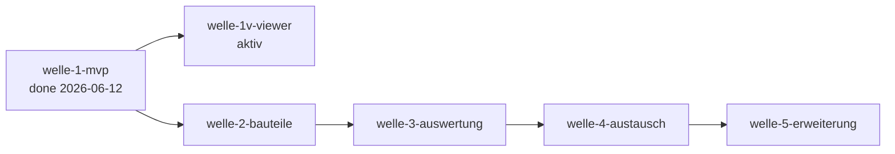

# Roadmap — b-cad

**Status:** Aktiv. **Letzte Änderung:** 2026-06-12.

**Format-Regel:** Reihenfolge von **Wellen**, keine Reihenfolge von
Terminen. Daten sind Schätzungen, korrigierbar. Die Roadmap entstand im
Greenfield-Bootstrap (Kurs-Modul 2, Schritt 5) — sie ist eine
Feature-Sequenz, kein Reconciliation-Plan.

---

## Aktuelle Welle

**Welle-ID:** welle-1v-viewer
**Start:** 2026-06-12 (Trigger „welle-1 done" erfüllt — Closure
2026-06-12, [`../done/welle-1-results.md`](../done/welle-1-results.md))
**Geplantes Ende:** offen (Aufwands-Schätzung M aus §Nächste Wellen)

**Welle-Ziel:** Die *sichtbare* Hälfte des Echtzeit-Vertrags: ein
Qt-6-3D-Viewer (Driving Adapter) stellt das extrudierte
Gebäudemodell dar und folgt committeten Änderungen über den
ADR-0008-Vertrag — erfüllt **ACC-002** und die sichtbare Hälfte von
**LH-FA-D3-002** (Scope-Herkunft: slice-010a, Drift-Tabelle
2026-06-11).

**Closure-Trigger** (jeder Trigger beobachtbar):
- slice-011a done — ADR-0009 „GUI-Framework-Bindung Qt 6 (Driving
  Adapter)" accepted (Entscheidungs-Pflichten a–f) +
  Spec-Operationalisierung „sichtbar". (Plan-Review gelaufen
  2026-06-12, MR-006 erfüllt.)
- slice-011b done — Viewer-Adapter implementiert: ACC-002-Beleg
  liegt vor und ist abgenommen, Qt-Grenz-Sensor im arch-check grün
  (Form gemäß ADR-0009 Pflicht (c)), display-freie AK-Tests grün.
  Trigger: slice-011a done. *(Abnahme Runde 1 zurückgestellt →
  slice-012; Runde 2 mit regeneriertem Beleg am 2026-06-12 erteilt.)*
- slice-012 done — Eckenschluss endpunkt-verbundener Wände
  (LH-FA-WAL-006-Teilumfang geschärft + implementiert);
  ACC-002-Beleg ohne offene Außenecken regeneriert. Trigger:
  Abnahme-Befund slice-011b DoD-4 (2026-06-12).
- Closure-Notiz in `done/welle-1v-results.md` inkl. zwingendem
  Carveout-Audit.

## Nächste Wellen

| Welle | Trigger | Wichtigste Slices (geplant) | Geschätzter Aufwand |
|---|---|---|---|
| welle-2-bauteile | welle-1 done | Türen/Fenster mit Wandöffnung (`DOR`,`WIN`), Treppen (`STR`), Decken/Dach (`SLB`,`ROF`) | L |
| welle-3-auswertung | welle-2 done | Material (`MAT`), Auswertungen (`EVL`), Bemaßung/Layer (`DRW`) | M |
| welle-4-austausch | welle-3 done + ADR zu IFC-Bibliothek accepted | IFC/DXF/STEP/STL-Adapter (`IO`), PDF/PNG-Export | L |
| welle-5-erweiterung | welle-4 done | Plugin-System (`PLG`), UI-Themes/Docking (`UI`), Mehrsprachigkeit (`LH-QA-006`) | M |

## Meilensteine

| Meilenstein | Welle(n) | Trigger | Status |
|---|---|---|---|
| M1 — Lauffähiges MVP | welle-1-mvp | ACC-001-Kern erstellbar, `make gates` grün | erreicht (2026-06-12; Viewer per Drift-Entscheidung 2026-06-11 nicht Teil des Triggers) |
| M2 — Vollständige Bauteile | welle-2-bauteile | Haus mit Türen, Fenstern, Dach vollständig | offen |
| M3 — Auswertbar | welle-3-auswertung | Flächen/Volumen/Materiallisten korrekt | offen |
| M4 — Offen austauschbar | welle-4-austausch | ACC-003, ACC-004 erfüllt | offen |
| M5 — Erweiterbar | welle-5-erweiterung | OBJ-004 (Plugins) erfüllt | offen |

## Abhängigkeitsgraph

## Abgeschlossene Wellen

| Welle | Zeitraum | Ergebnis | Closure-Notiz |
|---|---|---|---|
| welle-1-mvp | 2026-06-08 – 2026-06-12 | Kern-MVP als Vertrag: Projekt anlegen/speichern/laden (atomar + Crash-Recovery), Geschosse, Wände, Raum-Autoerkennung, OCC-Extrusion + Echtzeit-Benachrichtigung; 13 Slices + spike-001 in `done/`; Review + Verifikation gelaufen, Findings behoben (`330d5d0`). Sichtbarer Viewer → `welle-1v-viewer`. | [`../done/welle-1-results.md`](../done/welle-1-results.md) |

## Historische Trigger-Verschiebungen

| Datum | Was wurde geändert? | Warum? |
|---|---|---|
| 2026-06-09 | `slice-003` in `slice-003a` (Kern, OCC-frei) + `slice-003b` (OCC-Extrusion + arch-check Regel C) geschnitten | Slice zu groß für eine Review-Sitzung (Modul 5); OCC-Teil ist build-schwer/risikobehaftet und wird isoliert. ADR-0002 dabei auf Backend-Scope verengt + accepted (slice-003-Review, Findings 1–3). |
| 2026-06-11 | `slice-009` in `slice-009a` (ADR-0007 + Spec-Schärfung) + `slice-009b` (Implementierung + Tests) geschnitten | Plan-Review-Findings H1/M1/M2: ADR-0007 trägt mehr Entscheidungsgewicht als geplant (Polygon-Basis **und** Verschachtelungs-Repräsentation), ADR-Accept ist Review-Checkpoint und gehört nicht mitten in einen Implementierungs-Slice (Präzedenz slice-007, slice-003-Split). |
| 2026-06-11 | Sichtbarer 3D-Viewer aus welle-1 in eigene Welle `welle-1v-viewer` gelöst; Welle-Ziel und Viewer-Trigger-Zeile angepasst | Scope-Entscheidung slice-010a: GUI-Grundsatz-ADR (Qt 6) fehlt noch, M1-Trigger (ACC-001-Kern + Gates) verlangt keinen Viewer; ACC-002 wird in `welle-1v-viewer` erfüllt — kein stilles `done` über den Kern-Vertrag (Lastenheft-Wortlaut „sichtbar" bleibt unverändert benutzer-beobachtbar). |
| 2026-06-12 | `welle-1v-viewer` um slice-012 erweitert (Eckenschluss endpunkt-verbundener Wände, LH-FA-WAL-006-Teilumfang); slice-011b-Abnahme (DoD-4) auf den regenerierten Beleg verschoben | Abnahme-Befund des Projektinhabers am ACC-002-Beleg: Wände schließen an Außenecken nicht (fehlendes ½×½-Stärke-Quadrat, [Befund-2D](../done/acc-002-befund-2d-ecken.png)) — modell-treu gerendert, aber als Abnahme-Artefakt nicht tragfähig; WAL-006-Teilumfang wird vorgezogen statt die Grenze nur zu dokumentieren. |
