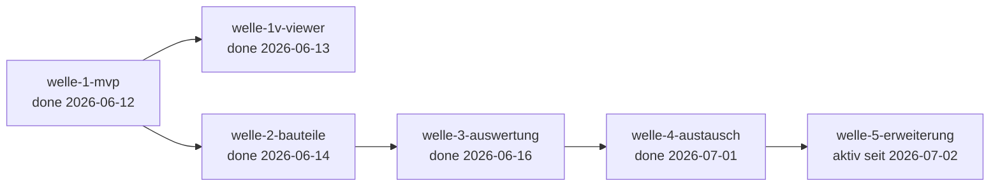

# Roadmap — b-cad

**Status:** Aktiv. **Letzte Änderung:** 2026-07-03.

**Format-Regel:** Reihenfolge von **Wellen**, keine Reihenfolge von
Terminen. Daten sind Schätzungen, korrigierbar. Die Roadmap entstand im
Greenfield-Bootstrap (Kurs-Modul 2, Schritt 5) — sie ist eine
Feature-Sequenz, kein Reconciliation-Plan.

---

## Aktuelle Welle

**Welle-ID:** welle-5-erweiterung
**Zeitraum:** ab 2026-07-02 (Ziel: Meilenstein M5 „Erweiterbar")

**Vorgänger-Trigger (beide erfüllt):** welle-4-austausch done (2026-07-01,
[`../done/welle-4-results.md`](../done/welle-4-results.md)) + Plugin-API-/ABI-ADR accepted
([ADR-0017](../../adr/0017-plugin-api-abi.md), 2026-07-02 — unabhängiges Text-Review
1 HIGH/4 MED/2 LOW/3 INFO + Projektinhaber-Durchsicht 2 LOW/2 INFO, alle eingearbeitet).

**Welle-Ziel:** b-cad wird **erweiterbar** ([OBJ-004](../../../../spec/lastenheft.md#3-projektziele), Meilenstein M5):
ein **Plugin-System** (`PLG`, [LH-FA-PLG-001](../../../../spec/lastenheft.md#modul-plugin-system-plg)..004) hinter dem
**Plugin-Host als Driving Adapter** ([ADR-0017](../../adr/0017-plugin-api-abi.md): `dlopen` +
versionierter `extern "C"`-Handshake fail-closed + C++-Port-Facade, Plugins sehen nur
model + Driving-Ports, Sandbox = Port-Vermittlung + Fehler-Barriere, arch-check-**Regel P**).
Dazu die aus welle-3 zurückgestellten **2D-Zeichen-Werkzeuge `DRW`**
([LH-FA-DRW-001](../../../../spec/lastenheft.md#modul-zeichnungsfunktionen-drw)..007), **UI-Themes/Docking**
([LH-FA-UI-001](../../../../spec/lastenheft.md#modul-benutzeroberfläche-ui)..005-Teilumfang) und **Mehrsprachigkeit**
([LH-QA-006](../../../../spec/lastenheft.md#lh-qa-006--mehrsprachigkeit)). **M5-bindend ist allein der PLG-Strang**
([OBJ-004](../../../../spec/lastenheft.md#3-projektziele) »Erweiterung durch Plugins«); DRW/UI/Mehrsprachigkeit sind
Wellen-Inhalt ohne Meilenstein-Bindung — bei Umfangs-Druck entscheidet der Projektinhaber
über Nachschnitt (Modul-5-Sizing), nicht der Kalender.

**Closure-Trigger** (deliverable-granular; konkrete Slices emergieren mit
[MR-006](../../../../harness/conventions.md#mr-006--unabhängiges-plan-review-vor-implementierungs-start)-Plan-Review):
- ✓ **Plugin-API-/ABI-ADR** ([ADR-0017](../../adr/0017-plugin-api-abi.md)) accepted (zwei
  unabhängige Review-Runden, keine offenen HIGH/MED) — der Wellen-Trigger.
- **PLG-Schärfung + Impl** ([ADR-0017](../../adr/0017-plugin-api-abi.md)-Folgepflichten):
  [LH-FA-PLG-001](../../../../spec/lastenheft.md#modul-plugin-system-plg)..004-AK (lösungsfrei,
  [MR-008](../../../../harness/conventions.md#mr-008--lastenheft-schärfung-bleibt-lösungsfrei); Sandbox-AK auf beobachtbares
  Fehlverhalten wohlgeformter Plugins bezogen) + Spec-§4/§5/§6-Nachzug; Plugin-Host +
  Plugin-API + Beispiel-/Test-Plugin (`plugins/`-Baum) + AK-Tests (werfendes Plugin,
  ABI-Mismatch, Load→Edit→Unload mit realer `.so`) + arch-check-**Regel P**; benannte
  Impl-Entscheidungen mit Beleg (Symbol-Naht, Gate-Scope `plugins/`, Unload-Strategie)
  → [OBJ-004](../../../../spec/lastenheft.md#3-projektziele) erfüllt = **M5-Trigger**.
- **DRW-Strang:** 2D-Zeichen-Werkzeuge ([LH-FA-DRW-001](../../../../spec/lastenheft.md#modul-zeichnungsfunktionen-drw)..007,
  aus welle-3 zurückgestellt) — Scope-Schnitt je [MR-006](../../../../harness/conventions.md#mr-006--unabhängiges-plan-review-vor-implementierungs-start);
  je gelieferter Familie Outline → AK.
- **UI-Strang:** dunkles/helles Theme + Docking-Teilumfang
  ([LH-FA-UI-001](../../../../spec/lastenheft.md#modul-benutzeroberfläche-ui)..003).
- **Mehrsprachigkeit:** [LH-QA-006](../../../../spec/lastenheft.md#lh-qa-006--mehrsprachigkeit)
  (Deutsch/Englisch, UI-Strings vollständig aus Ressourcen).
- Unabhängige Welle-Verifikation + Carveout-Audit + `done/welle-5-results.md`;
  [OBJ-004](../../../../spec/lastenheft.md#3-projektziele) erfüllt → **Meilenstein M5**.

**Fortschritt (Stand 2026-07-03):**
- ✓ **slice-026b — Plugin-System lauffähig** (2026-07-03; Host/API/Beispiel-Plugin/Regel P):
  Plugin-Host als Driving Adapter (`src/adapters/plugin/`, dlfcn-Monopol) mit
  fail-closed-Handshake, 7-Stufen-Lifecycle und Fehler-Barriere
  ([`E-PLG-001`](../../../../spec/spezifikation.md#4-fehler-codes-und-logging-felder),
  `plugin_rejected`/`plugin_error`); Plugin-API `src/plugin_api/` (Port-Subset v1 =
  `EditStructurePort`+`EvaluatePort`, invalidierbarer Kontext); `plugins/`-Baum
  (Beispiel + 4 Fixtures, MODULE ohne Kern-Linkage); **Symbol-Naht = `ENABLE_EXPORTS`**
  (Beleg: Exception aus realer `.so` im Host gefangen); `--plugin`-CLI;
  **arch-check-Regel P** + lint-Scope `plugins/`. 8 AK-Tests mit realer `.so`;
  [MR-006](../../../../harness/conventions.md#mr-006--unabhängiges-plan-review-vor-implementierungs-start)
  0 HIGH + unabhängiges Code-Review **0 HIGH** (3 MED/2 LOW vor Closure behoben);
  gates grün (228/228, 90,3 %). **Beide [ADR-0017](../../adr/0017-plugin-api-abi.md)-Folgepflichten
  erfüllt — der [OBJ-004](../../../../spec/lastenheft.md#3-projektziele)/M5-Pfad ist frei**
  (M5-Buchung = Projektinhaber-Entscheidung bei der Welle-Closure; benannte Lücke:
  GUI-Plugin-Verwaltung → UI-Strang).
- ✓ **slice-026a — PLG-AK-Schärfung + Spec-Mapping** (2026-07-03, reine Doku/Entscheidung):
  [LH-FA-PLG-001](../../../../spec/lastenheft.md#lh-fa-plg-001)..004 von Outline auf AK
  (Lastenheft **0.1.13**, lösungsfrei/benutzer-beobachtbar, per-ID-Inline-Anker; Sandbox-AK
  auf **wohlgeformtes** Fehlverhalten bezogen + Ehrlichkeits-Klausel mit beiden Grenzfällen
  Absturz→Crash-Recovery/[LH-QA-005](../../../../spec/lastenheft.md#lh-qa-005--crash-recovery)
  **oder** Silent-Corruption ohne Schutz) + spez. §1
  [`LH-FA-PLG-001.a`](../../../../spec/lastenheft.md#lh-fa-plg-001)-Sammelblock
  (Host/Handshake exakt-fail-closed/Lifecycle/Port-Vermittlung pull-only/Threading/
  Fehler-Barriere), §4 [`E-PLG-001`](../../../../spec/spezifikation.md#4-fehler-codes-und-logging-felder)
  = **ein Code, zwei Log-Events** (`plugin_rejected`/`plugin_error`), §5 Span
  `bcad.plugin.lifecycle`, §6 Plugin-API-Vertragszeile; `.d-check.yml`-ids-Familie um PLG
  (Verschärfung). [MR-006](../../../../harness/conventions.md#mr-006--unabhängiges-plan-review-vor-implementierungs-start)
  **0 HIGH** + unabhängige read-only-Diff-Durchsicht **0 HIGH/MED/LOW**; `make gates` grün.
  Erste [ADR-0017](../../adr/0017-plugin-api-abi.md)-Folgepflicht erfüllt →
  **slice-026b (PLG-Impl) startbar** (eigenes
  [MR-006](../../../../harness/conventions.md#mr-006--unabhängiges-plan-review-vor-implementierungs-start) davor).
- ✓ **[ADR-0017](../../adr/0017-plugin-api-abi.md) „Plugin-API-/ABI-Vertrag und Sandbox-Modell" accepted** —
  `dlopen`/`dlsym`/`dlclose` (glibc, **keine neue Dependency**, kein `QPluginLoader` — Regel E)
  + versionierter `extern "C"`-Handshake fail-closed + C++-Port-Facade **in-process** unter
  gepinnter Toolchain; Plugins sehen nur model + Driving-Ports (kein Beobachter-Zugang v1);
  Sandbox = Port-Vermittlung + Fehler-Barriere mit ehrlich benannten Grenzen (kein
  Speicherschutz, Silent-Corruption-Pfad, Threading-Vertrag); Symbol-Naht = benannte
  Impl-Entscheidung (statisches Kern-Dazulinken verboten). Unabhängiges Text-Review
  (**1 HIGH** — nicht existierender Undo-Stack als Ist behauptet, behoben — + 4 MED + 2 LOW
  + 3 INFO) + Projektinhaber-Durchsicht (2 LOW + 2 INFO), alle eingearbeitet; Folgepflichten
  im [ADR-Index](../../adr/README.md). **Welle-Trigger erfüllt, Welle gestartet.**

## Nächste Wellen

Keine Folge-Welle benannt — die nächste Welle nach M5 ist eine
**Planungs-Entscheidung** (kein Automatismus). Benannte Kandidaten-Themen aus
den Re-Eval-Trägern der welle-3/-4-Closures: Format-Reichtum (IFC-/DXF-
Bibliothek, PDF-Fit-to-Page/Bemaßung), Wandtyp-Bibliothek (`wall_type`-
Template-Fallback), Observability (`TracingPort`-Anbindung), Drittanbieter-
Attribution (slice-006 in `open/`).

## Meilensteine

| Meilenstein | Welle(n) | Trigger | Status |
|---|---|---|---|
| M1 — Lauffähiges MVP | welle-1-mvp | [ACC-001](../../../../spec/lastenheft.md#7-abnahmekriterien)-Kern erstellbar, `make gates` grün | erreicht (2026-06-12; Viewer per Drift-Entscheidung 2026-06-11 nicht Teil des Triggers) |
| M2 — Vollständige Bauteile | welle-2-bauteile | Haus mit Türen, Fenstern, Dach vollständig | **erreicht** (2026-06-14; vier Bauteil-Familien geliefert + Decken/Fundament/Treppen, welle-2-Closure) |
| M3 — Auswertbar | welle-3-auswertung | Flächen/Volumen/Materiallisten korrekt | **erreicht** (2026-06-16; `EvaluatePort` Flächen/Volumen/Wohnfläche + Material-/Kosten-/Tür-/Fensterlisten analytisch im Kern, welle-3-Closure) |
| M4 — Offen austauschbar | welle-4-austausch | [ACC-003](../../../../spec/lastenheft.md#7-abnahmekriterien), [ACC-004](../../../../spec/lastenheft.md#7-abnahmekriterien) erfüllt | **erreicht** (2026-07-01; alle sechs Austauschformate IFC/DXF/STEP/STL/PDF/PNG hinter Driven-Adaptern, [ACC-003](../../../../spec/lastenheft.md#7-abnahmekriterien) IFC-Export-Roundtrip + [ACC-004](../../../../spec/lastenheft.md#7-abnahmekriterien) maßstäblicher PDF-Plan, welle-4-Closure) |
| M5 — Erweiterbar | welle-5-erweiterung | [OBJ-004](../../../../spec/lastenheft.md#3-projektziele) (Plugins) erfüllt | offen |

## Abhängigkeitsgraph

## Abgeschlossene Wellen

| Welle | Zeitraum | Ergebnis | Closure-Notiz |
|---|---|---|---|
| welle-1-mvp | 2026-06-08 – 2026-06-12 | Kern-MVP als Vertrag: Projekt anlegen/speichern/laden (atomar + Crash-Recovery), Geschosse, Wände, Raum-Autoerkennung, OCC-Extrusion + Echtzeit-Benachrichtigung; 13 Slices + spike-001 in `done/`; Review + Verifikation gelaufen, Findings behoben (`330d5d0`). Sichtbarer Viewer → `welle-1v-viewer`. | [`../done/welle-1-results.md`](../done/welle-1-results.md) |
| welle-1v-viewer | 2026-06-12 – 2026-06-13 | Sichtbare Hälfte des Echtzeit-Vertrags: Qt-6-3D-Viewer (Driving Adapter) stellt das extrudierte Gebäudemodell dar und folgt committeten Änderungen — **[ACC-002](../../../../spec/lastenheft.md#7-abnahmekriterien) erfüllt** + sichtbare Hälfte [LH-FA-D3-002](../../../../spec/lastenheft.md#lh-fa-d3-002--echtzeitaktualisierung); slice-011a/011b + slice-012 (Eckenschluss WAL-006-Teilumfang) in `done/`. Unabhängige Verifikation gelaufen (keine HIGH/MEDIUM, 1 LOW); `make gates` grün am HEAD (63/63, Coverage 94,2 %). | [`../done/welle-1v-results.md`](../done/welle-1v-results.md) |
| welle-2-bauteile | 2026-06-13 – 2026-06-14 | **Alle parametrischen Bauteile** über die Wände hinaus: Türen/Fenster (automatische Wandöffnung, OCC-Boolean), Dach (Sattel/Walm/Pult), Decken/Fundament (Platten + Ausschnitte), Treppen (gerade einläufig) — je Familie Lastenheft-AK-Schärfung + Implementierung (Domäne/Geometrie/Viewer/Edit-Ops) + Persistenz; **12 Slices** in `done/`, **[ADR-0011](../../adr/0011-bauteil-hosting-wandoeffnung.md) (#6)-Leitplanke** über vier Familien. **Meilenstein M2 erreicht** + [ACC-001](../../../../spec/lastenheft.md#7-abnahmekriterien)-Bauteil-Hälfte. Unabhängige Verifikation (keine HIGH, 1 MED/1 LOW behoben) + Carveout-Audit (keine aktiven); `make gates` grün am HEAD `d7073fb` (116/116, Coverage 92,3 %). Geometrielastige Code-Reviews je Familie (013b/014b/015b je 1 HIGH gefixt, 016b keine HIGH). | [`../done/welle-2-results.md`](../done/welle-2-results.md) |
| welle-3-auswertung | 2026-06-14 – 2026-06-16 | **Gebäudemodell auswertbar** ([ADR-0012](../../adr/0012-evaluations-architektur.md) `EvaluatePort` read-only/pull, **kein** `GeometryKernelPort`/`Solid.volume_mm3`): Flächen EVL-001/003 (Shoelace-Raum-Netto + Wohnfläche), **Volumen EVL-002 analytisch im Kern** (Wand/Decke/Treppe; Dach dicke-los → benannte Lücke), **Material-System** MAT-001/002/003/005/006 (projekt-eigen über `EditStructurePort`, `restrict`-treu, NULL-sicher round-trippt über SQLite), **Listen** EVL-004/005/006 (Material-Menge=Σ Netto-Volumen, Tür-/Fensterlisten) + **Kosten MAT-006** (`Menge × cost_per_m3`); `wall_type`-Template-Fallback bewusst zurückgestellt (welle-4+). **7 Slices** (017a–017g) in `done-archive/`. **Meilenstein M3 erreicht**. Unabhängige Verifikation (0 HIGH, 1 LOW behoben) + Carveout-Audit (keine aktiven); `make gates` grün am HEAD (145/145, Coverage 92,7 %), `make schema-check` grün. | [`../done/welle-3-results.md`](../done/welle-3-results.md) |
| welle-4-austausch | 2026-06-16 – 2026-07-01 | **b-cad offen austauschbar** ([OBJ-005](../../../../spec/lastenheft.md#3-projektziele)): **alle sechs Austauschformate** hinter Driven-Adaptern (Kern format-frei) — **IFC** Import+Export ([ADR-0013](../../adr/0013-ifc-bibliothek.md) SPF-Subset-Codec Option D, [ACC-003](../../../../spec/lastenheft.md#7-abnahmekriterien)-Roundtrip), **STEP/STL** Export ([ADR-0014](../../adr/0014-step-stl-export-backend.md) OCC-DataExchange nativ, B-Rep **aller** 3D-Bauteile via 024a/b), **DXF** Import+Export ([ADR-0015](../../adr/0015-dxf-backend.md) 2D-Subset-Codec Option D + Kern-`ImporterMap`), **PDF** ([ADR-0016](../../adr/0016-pdf-png-backend.md) self-rolled Vektor-Maßstabsplan, [ACC-004](../../../../spec/lastenheft.md#7-abnahmekriterien)) + **PNG** (self-rolled Raster-Grundriss). Nebenbei **Dach-Volumen** ([LH-FA-ROF-006](../../../../spec/lastenheft.md#lh-fa-rof-006), erste Repo-Schema-Änderung) + **io-smoke** (CI-Sensor). **16 Slices** (019a–025c) in `done-archive/`, vier Backend-ADRs (0013–0016). **Meilenstein M4 erreicht.** Unabhängige Verifikation (0 HIGH, 1 LOW außerhalb Scope belassen) + Carveout-Audit (keine aktiven); `make gates` grün am HEAD (220/220, Coverage 90,7 %), `make schema-check` + `make io-smoke` grün. | [`../done/welle-4-results.md`](../done/welle-4-results.md) |

## Historische Trigger-Verschiebungen

| Datum | Was wurde geändert? | Warum? |
|---|---|---|
| 2026-06-09 | `slice-003` in `slice-003a` (Kern, OCC-frei) + `slice-003b` (OCC-Extrusion + arch-check Regel C) geschnitten | Slice zu groß für eine Review-Sitzung (Modul 5); OCC-Teil ist build-schwer/risikobehaftet und wird isoliert. [ADR-0002](../../adr/0002-geometrie-kern-opencascade.md) dabei auf Backend-Scope verengt + accepted (slice-003-Review, Findings 1–3). |
| 2026-06-11 | `slice-009` in `slice-009a` ([ADR-0007](../../adr/0007-raumerkennung-geometrie-basis.md) + Spec-Schärfung) + `slice-009b` (Implementierung + Tests) geschnitten | Plan-Review-Findings H1/M1/M2: [ADR-0007](../../adr/0007-raumerkennung-geometrie-basis.md) trägt mehr Entscheidungsgewicht als geplant (Polygon-Basis **und** Verschachtelungs-Repräsentation), ADR-Accept ist Review-Checkpoint und gehört nicht mitten in einen Implementierungs-Slice (Präzedenz slice-007, slice-003-Split). |
| 2026-06-11 | Sichtbarer 3D-Viewer aus welle-1 in eigene Welle `welle-1v-viewer` gelöst; Welle-Ziel und Viewer-Trigger-Zeile angepasst | Scope-Entscheidung slice-010a: GUI-Grundsatz-ADR (Qt 6) fehlt noch, M1-Trigger ([ACC-001](../../../../spec/lastenheft.md#7-abnahmekriterien)-Kern + Gates) verlangt keinen Viewer; [ACC-002](../../../../spec/lastenheft.md#7-abnahmekriterien) wird in `welle-1v-viewer` erfüllt — kein stilles `done` über den Kern-Vertrag (Lastenheft-Wortlaut „sichtbar" bleibt unverändert benutzer-beobachtbar). |
| 2026-06-12 | `welle-1v-viewer` um slice-012 erweitert (Eckenschluss endpunkt-verbundener Wände, [LH-FA-WAL-006](../../../../spec/lastenheft.md#lh-fa-wal-006--wand-verbinden)-Teilumfang); slice-011b-Abnahme (DoD-4) auf den regenerierten Beleg verschoben | Abnahme-Befund des Projektinhabers am [ACC-002](../../../../spec/lastenheft.md#7-abnahmekriterien)-Beleg: Wände schließen an Außenecken nicht (fehlendes ½×½-Stärke-Quadrat, [Befund-2D](../done/acc-002-befund-2d-ecken.png)) — modell-treu gerendert, aber als Abnahme-Artefakt nicht tragfähig; WAL-006-Teilumfang wird vorgezogen statt die Grenze nur zu dokumentieren. |
| 2026-06-14 | `welle-3-auswertung` gestartet; Scope auf **MAT + EVL** (Auswertungs-Kern, M3) gesetzt, **`DRW` (Bemaßung/Layer/Fangpunkte/Raster/Hilfslinien/Gruppen) nach welle-5 zurückgestellt** | Welle-Name + M3-Trigger („Flächen/Volumen/Materiallisten korrekt") zielen auf Auswertung; `DRW` ist 2D-Zeichen-Interaktion (UX) ohne M3-Bezug und passt zu den UI-Werkzeugen von welle-5 — die Trennung hält welle-3 kohärent (Modul-5-Sizing, Auswertung ≠ 2D-Editor). |
| 2026-06-15 | **Quergewerk slice-018a/b/c** eingeschoben (Doku-Referenz-Gate, `harness-steering`): `done-archive/`-Mechanik + Regelwerk-Referenz-Richtung Spec→ADR computational (d-check `matrix`/`ids`, [MR-011](../../../../harness/conventions.md#mr-011--referenz-integritäts-gate-matrix-ids-spans-hostpaths)); **018b** weitet `ids` auf den Voll-Korpus (alle 7 ID-Familien, Linker `tools/idlink.py`), **018c** hebt Bullet-Sub-IDs per Inline-HTML-Anker (d-check v0.9.0) auf präzise Per-ID-Anker. **M3-Scope (MAT+EVL) unberührt.** | d-check-v0.8.0-Hebung stellt `matrix`/`ids`/`spans`/`hostpaths` bereit; die Referenz-Richtung war bis dahin nur inferential ([MR-006](../../../../harness/conventions.md#mr-006--unabhängiges-plan-review-vor-implementierungs-start)-Plan-Review). Quergewerk, kein welle-3-Feature — die Roadmap-Sequenz bleibt unverändert. |
| 2026-06-18 | **Quergewerk io-smoke** (slice-022) eingeschoben: `make io-smoke` — headless Binary-Smoke aller IO-Formate (CI-only, LH-Bindung [LH-FA-IO-001](../../../../spec/lastenheft.md#lh-fa-io-001--ifc-import)…[LH-FA-IO-006](../../../../spec/lastenheft.md#lh-fa-io-006)), belegt die coverage-ausgenommene `main.cpp`-CLI-/Composition-Root-Glue. **welle-4-Scope unberührt.** | Aufkommende Frage „Binary-/CLI-E2E?": die port-tiefe Integration (slice-019–021) deckt die Use-Cases, aber die CLI-/Verdrahtungs-Glue war ungetestet (`main.cpp` coverage-ausgenommen); minimal-additiver Sensor, Muster `acc-002-beleg` — kein welle-Feature, Sequenz unverändert. |
| 2026-06-18 | **„STEP-B-Rep Dächer/Treppen" → Dach-Volumen-Initiative re-skopiert** (023a–c, dann 024): der Roadmap-Einzeiler „Mesh→Vernähung" war nicht tragfähig. Erst **Dach-Volumen** (neue [LH-FA-ROF-006](../../../../spec/lastenheft.md#lh-fa-rof-006), Lastenheft 0.1.11), dann STEP für Dächer+Treppen. **welle-4-Sequenz unberührt** (M4-Pfad bleibt [ACC-003](../../../../spec/lastenheft.md#7-abnahmekriterien)/[ACC-004](../../../../spec/lastenheft.md#7-abnahmekriterien)). | [MR-006](../../../../harness/conventions.md#mr-006--unabhängiges-plan-review-vor-implementierungs-start)-Plan-Review zum (verworfenen) STEP-Slice fand **HIGH-1**: die Display-Netze sind **nicht wasserdicht** — `roofMesh` ist eine offene Fläche, `Roof` trägt **kein** Dicke-Feld (dicke-loses Modell) → Vernähung ergäbe ungültige Solids. Projektinhaber wählte „Dach-Volumen zuerst, Regelwerk-konform". |
| 2026-07-03 | **Quergewerk slice-028/029 eingeschoben (a-check-Vorbereitung, `harness-steering`):** zwei Pilot-Befunde des a-check-Schwester-Tools (v0.8.0) werden b-cad-seitig vor der geplanten Gate-Umstellung (`tools/arch-check.sh` → a-check, eigener Folge-Slice Muster [MR-007](../../../../harness/conventions.md#mr-007--auflösung-von-mr-003-docs-check-via-d-check)) beseitigt: **028** reklassifiziert die fünf reinen Berechnungs-Kerne verzeichnislich nach `src/hexagon/services/geometry/` (Adapter→Service-Includes werden zur deklarierten Kante), **029** trennt den ui-Misch-Adapter in `view/` (driven) + `command/` (driving) mit port-freier `MeshSource`-Naht. **welle-5-Scope unberührt** (Sequenz unverändert; slice-027 lint-Härtung bleibt geparkt startbar). | a-check-Pilot-Lauf des Projektinhabers (2026-07-03) mit verifizierten Befunden; künftige Richtungs-Prüfung schneidet Schichten über Verzeichnis-Globs — beide Umbauten sind Struktur-Voraussetzung des Pilot-Schnitts, kein Wellen-Feature. |
| 2026-07-04 | **Quergewerk slice-030 eingeschoben (a-check-Gate-Umstellung vollzogen, `harness-steering`):** das primäre Architektur-Gate ist von `tools/arch-check.sh` auf das externe digest-gepinnte Image **a-check** (v0.9.0, `.a-check.yml`, `make a-check` als `gates`-Member) umgestellt — Muster [MR-007](../../../../harness/conventions.md#mr-007--auflösung-von-mr-003-docs-check-via-d-check), verankert als [MR-013](../../../../harness/conventions.md#mr-013--arch-check-via-a-check) (**keine ADR:** keine [§2.6](../../../../AGENTS.md)-Lockerung — a-check ist strenger, Schicht-Kanten + driving/driven-Richtung neu). `tools/arch-check.sh` bleibt als **P-Rest** (`dlopen`/`dlsym`/`dlclose`-Aufruf + feine P2-Import-Allowlist). b-cad = **erster a-check-Pilot-Konsument** (a-check-Meilenstein M3). **welle-5-Scope unberührt** (Sequenz unverändert; slice-027 lint-Härtung bleibt geparkt startbar). | a-check v0.9.0 released (Root-Sub-Einheit/Blatt-Klassifikation tilgt die früheren Falsch-Positive `x.cpp → x.h`); Struktur-Vorbedingungen slice-028/029 geliefert; Pre-Flight 0 Befunde + Gegenprobe `core-impurity` reproduziert; [MR-006](../../../../harness/conventions.md#mr-006--unabhängiges-plan-review-vor-implementierungs-start) 0 HIGH/3 MED (eingearbeitet). |
