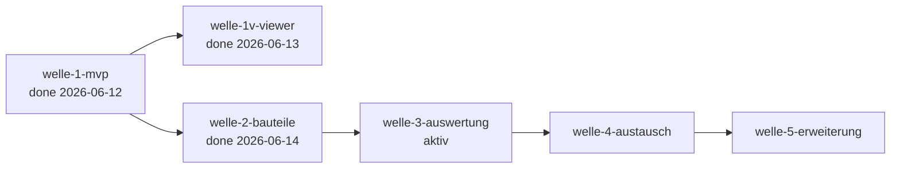

# Roadmap — b-cad

**Status:** Aktiv. **Letzte Änderung:** 2026-06-16.

**Format-Regel:** Reihenfolge von **Wellen**, keine Reihenfolge von
Terminen. Daten sind Schätzungen, korrigierbar. Die Roadmap entstand im
Greenfield-Bootstrap (Kurs-Modul 2, Schritt 5) — sie ist eine
Feature-Sequenz, kein Reconciliation-Plan.

---

## Aktuelle Welle

**Welle-ID:** welle-3-auswertung
**Start:** 2026-06-14 (bewusste Planungs-Entscheidung nach welle-2-Closure,
[`../done/welle-2-results.md`](../done/welle-2-results.md))
**Geplantes Ende:** offen (Aufwands-Schätzung M)

**Welle-Ziel:** Das Gebäudemodell wird **auswertbar** — **Material-System**
(`MAT`) + **Auswertungen** (`EVL`): Flächen-, Volumen-, Wohnflächenberechnung
und Material-/Tür-/Fensterlisten. Auswertung ist eine **reine Ableitung aus dem
committeten Modell** (Query, **kein** Geometrie-Erzeugen) — über einen
Auswertungs-Driving-Port und ein Material-Domänenmodell. Das `materials`-Schema
+ `material_id`-FKs liegen vor ([ADR-0006](../../adr/0006-relationales-schema-design.md)); `MaterialLibraryPort` (driven) und die
EVL-001..003-Zuordnung zu `DetectRoomsPort` sind in `architecture.md` §1.2/§1.1
bereits deklariert. **EVL-Flächen setzen auf der Footprint-Fläche (Shoelace)
auf**, nicht auf Länge·Stärke (spez. §1-Hinweis aus welle-1v/welle-2-Closure).
Erfüllt **Meilenstein M3** („Flächen/Volumen/Materiallisten korrekt").

**Scope-Entscheidung 2026-06-14:** welle-3 = **Auswertungs-Kern MAT + EVL**
(M3-kritisch). Das **`DRW`-Modul** (Fangpunkte/Raster/Winkelvorgaben/Bemaßung/
Hilfslinien/Layer/Gruppen) ist **2D-Zeichen-Interaktion (UX), orthogonal zu M3**
und wird **bewusst zurückgestellt** (eigene spätere Welle/Erweiterung; das
`layers`-Schema liegt bereits vor). Die Roadmap-Zeile nannte DRW unter welle-3 —
das Welle-Sizing hält den Auswertungs-Fokus kohärent zum Welle-Namen (Begründung
in §Historische Trigger-Verschiebungen).

**Closure-Trigger** (deliverable-granular; konkrete Slices emergieren mit
[MR-006](../../../../harness/conventions.md#mr-006--unabhängiges-plan-review-vor-implementierungs-start)-Plan-Review):
- **Auswertungs-/Material-Architektur-ADR + Spec/Lastenheft-Schärfung** (erster
  Slice, Muster slice-013a): Grundsatz-Entscheidung für den Auswertungs-Port
  (neu vs. `DetectRoomsPort`-Erweiterung), das Auswertungs-Ergebnis-Modell, das
  Material-Domänenmodell + Zuweisung, und die Flächen-/Volumen-/Listen-Algorithmik
  (Shoelace) — Lastenheft-AK lösungsfrei ([MR-008](../../../../harness/conventions.md#mr-008--lastenheft-schärfung-bleibt-lösungsfrei)), Mechanik in `spec`.
- **Material-System** ([`LH-FA-MAT-001..006`](../../../../spec/lastenheft.md#lh-fa-mat-001--materialien-verwalten)): Material-Domänentyp + Zuweisung an
  Bauteile (`material_id`), Bibliothek/Kennwerte (U-Wert/Kosten); Persistenz
  `materials` + `material_id`-Round-Trip (die welle-2-`NULL`-Felder werden nun
  getragen).
- **Auswertungen** ([`LH-FA-EVL-001..006`](../../../../spec/lastenheft.md#lh-fa-evl-001--flächenberechnung)): Flächen (Shoelace), Volumen,
  Wohnfläche, Material-/Tür-/Fensterlisten als Aggregation über das Modell;
  AK-Tests mit `LH-`-ID. **[MR-009](../../../../harness/conventions.md#mr-009--geometrielastiges-code-review-vor-welle-closure)** greift, wo neue Geometrie entsteht (hier
  überwiegend analytisch/Aggregation); je Schärfungs-Slice **[MR-010](../../../../harness/conventions.md#mr-010--lastenheft-header-version--oberste-9-historie-zeile)** (Header
  nachziehen).
- Unabhängige Welle-Verifikation (analog welle-1/-2) + Closure-Notiz in
  `done/welle-3-results.md` inkl. zwingendem Carveout-Audit.

**Fortschritt (Stand 2026-06-16):**
- ✓ **slice-017a** — Auswertungs-/Material-Architektur (**[ADR-0012](../../adr/0012-evaluations-architektur.md) „Evaluations-
  Architektur" accepted**) + Lastenheft-EVL/MAT-Schärfung (0.1.7) + Spec
  (`EvaluatePort` read-only/pull; Fläche = Shoelace-Raum-Netto/[ADR-0007](../../adr/0007-raumerkennung-geometrie-basis.md);
  Netto-Volumen analytisch im Kern; Material = konsumierte Eingabe). **Erster
  Closure-Trigger erfüllt.**
- ✓ **slice-017b** — **`EvaluatePort` implementiert** + Flächen EVL-001/003
  (Netto-Grundfläche je Raum/Geschoss + Wohnfläche), read-only-Aggregation der
  `Room.net_area_mm2`. `model::AreaReport`, `kLivingAreaFactor=1`. 122 Tests grün.
- ✓ **slice-017c** — **EVL-002 Volumen** implementiert: `EvaluatePort.volume()` →
  gebäudeweites Netto-Material-Volumen (m³) + Bauteiltyp-Subtotale (`VolumeReport`:
  Wand/Decke-Fundament/Treppe), **analytisch im Kern** (kein
  `GeometryKernelPort`/`Solid.volume_mm3`, [ADR-0012](../../adr/0012-evaluations-architektur.md) #4). Dach zurückgestellt
  (dicke-los, benannte Lücke + Re-Eval). **[MR-009](../../../../harness/conventions.md#mr-009--geometrielastiges-code-review-vor-welle-closure) 0 HIGH**; `make gates` grün (131 Tests).
- ✓ **slice-017d** — **Material-System** (MAT-001/002/003/005/006, **in-memory**):
  `model::Material` (Kennwerte U-Wert/Kosten) + projekt-eigene Verwaltung/Zuweisung
  über `EditStructurePort` + read-only Liste/Auflösung über `EvaluatePort`
  (`effectiveMaterial` — Quelle EVL-004/006). `removeMaterial` `restrict`-treu,
  Material-Mutationen op-frei. **Override** geliefert, `wall_type`-Fallback
  zurückgestellt. **[MR-006](../../../../harness/conventions.md#mr-006--unabhängiges-plan-review-vor-implementierungs-start) 1 HIGH** (removeMaterial-RESTRICT) eingearbeitet,
  **[MR-009](../../../../harness/conventions.md#mr-009--geometrielastiges-code-review-vor-welle-closure) n/a**; `make gates` grün (137 Tests).
- ⏳ offen: **slice-017e** (Material-**Persistenz**: `materials`-Tabelle +
  `material_id`-Round-Trip, die welle-2-`NULL`-Felder — **höhere Review-Latte**:
  Parsing/Schema-Drift/stille Datenverfälschung) · Listen EVL-004/005/006 ·
  `wall_type`-Fallback-Lücke · Welle-Verifikation + `done/welle-3-results.md`.

## Nächste Wellen

| Welle | Trigger | Wichtigste Slices (geplant) | Geschätzter Aufwand |
|---|---|---|---|
| welle-4-austausch | welle-3 done + ADR zu IFC-Bibliothek accepted | IFC/DXF/STEP/STL-Adapter (`IO`), PDF/PNG-Export | L |
| welle-5-erweiterung | welle-4 done | Plugin-System (`PLG`), UI-Themes/Docking + **2D-Zeichen-Werkzeuge `DRW`** (Bemaßung/Layer/Fangpunkte/Gruppen, aus welle-3 zurückgestellt), Mehrsprachigkeit ([`LH-QA-006`](../../../../spec/lastenheft.md#lh-qa-006--mehrsprachigkeit)) | M |

## Meilensteine

| Meilenstein | Welle(n) | Trigger | Status |
|---|---|---|---|
| M1 — Lauffähiges MVP | welle-1-mvp | [ACC-001](../../../../spec/lastenheft.md#7-abnahmekriterien)-Kern erstellbar, `make gates` grün | erreicht (2026-06-12; Viewer per Drift-Entscheidung 2026-06-11 nicht Teil des Triggers) |
| M2 — Vollständige Bauteile | welle-2-bauteile | Haus mit Türen, Fenstern, Dach vollständig | **erreicht** (2026-06-14; vier Bauteil-Familien geliefert + Decken/Fundament/Treppen, welle-2-Closure) |
| M3 — Auswertbar | welle-3-auswertung | Flächen/Volumen/Materiallisten korrekt | offen |
| M4 — Offen austauschbar | welle-4-austausch | [ACC-003](../../../../spec/lastenheft.md#7-abnahmekriterien), [ACC-004](../../../../spec/lastenheft.md#7-abnahmekriterien) erfüllt | offen |
| M5 — Erweiterbar | welle-5-erweiterung | [OBJ-004](../../../../spec/lastenheft.md#3-projektziele) (Plugins) erfüllt | offen |

## Abhängigkeitsgraph

## Abgeschlossene Wellen

| Welle | Zeitraum | Ergebnis | Closure-Notiz |
|---|---|---|---|
| welle-1-mvp | 2026-06-08 – 2026-06-12 | Kern-MVP als Vertrag: Projekt anlegen/speichern/laden (atomar + Crash-Recovery), Geschosse, Wände, Raum-Autoerkennung, OCC-Extrusion + Echtzeit-Benachrichtigung; 13 Slices + spike-001 in `done/`; Review + Verifikation gelaufen, Findings behoben (`330d5d0`). Sichtbarer Viewer → `welle-1v-viewer`. | [`../done/welle-1-results.md`](../done/welle-1-results.md) |
| welle-1v-viewer | 2026-06-12 – 2026-06-13 | Sichtbare Hälfte des Echtzeit-Vertrags: Qt-6-3D-Viewer (Driving Adapter) stellt das extrudierte Gebäudemodell dar und folgt committeten Änderungen — **[ACC-002](../../../../spec/lastenheft.md#7-abnahmekriterien) erfüllt** + sichtbare Hälfte [LH-FA-D3-002](../../../../spec/lastenheft.md#lh-fa-d3-002--echtzeitaktualisierung); slice-011a/011b + slice-012 (Eckenschluss WAL-006-Teilumfang) in `done/`. Unabhängige Verifikation gelaufen (keine HIGH/MEDIUM, 1 LOW); `make gates` grün am HEAD (63/63, Coverage 94,2 %). | [`../done/welle-1v-results.md`](../done/welle-1v-results.md) |
| welle-2-bauteile | 2026-06-13 – 2026-06-14 | **Alle parametrischen Bauteile** über die Wände hinaus: Türen/Fenster (automatische Wandöffnung, OCC-Boolean), Dach (Sattel/Walm/Pult), Decken/Fundament (Platten + Ausschnitte), Treppen (gerade einläufig) — je Familie Lastenheft-AK-Schärfung + Implementierung (Domäne/Geometrie/Viewer/Edit-Ops) + Persistenz; **12 Slices** in `done/`, **[ADR-0011](../../adr/0011-bauteil-hosting-wandoeffnung.md) (#6)-Leitplanke** über vier Familien. **Meilenstein M2 erreicht** + [ACC-001](../../../../spec/lastenheft.md#7-abnahmekriterien)-Bauteil-Hälfte. Unabhängige Verifikation (keine HIGH, 1 MED/1 LOW behoben) + Carveout-Audit (keine aktiven); `make gates` grün am HEAD `d7073fb` (116/116, Coverage 92,3 %). Geometrielastige Code-Reviews je Familie (013b/014b/015b je 1 HIGH gefixt, 016b keine HIGH). | [`../done/welle-2-results.md`](../done/welle-2-results.md) |

## Historische Trigger-Verschiebungen

| Datum | Was wurde geändert? | Warum? |
|---|---|---|
| 2026-06-09 | `slice-003` in `slice-003a` (Kern, OCC-frei) + `slice-003b` (OCC-Extrusion + arch-check Regel C) geschnitten | Slice zu groß für eine Review-Sitzung (Modul 5); OCC-Teil ist build-schwer/risikobehaftet und wird isoliert. [ADR-0002](../../adr/0002-geometrie-kern-opencascade.md) dabei auf Backend-Scope verengt + accepted (slice-003-Review, Findings 1–3). |
| 2026-06-11 | `slice-009` in `slice-009a` ([ADR-0007](../../adr/0007-raumerkennung-geometrie-basis.md) + Spec-Schärfung) + `slice-009b` (Implementierung + Tests) geschnitten | Plan-Review-Findings H1/M1/M2: [ADR-0007](../../adr/0007-raumerkennung-geometrie-basis.md) trägt mehr Entscheidungsgewicht als geplant (Polygon-Basis **und** Verschachtelungs-Repräsentation), ADR-Accept ist Review-Checkpoint und gehört nicht mitten in einen Implementierungs-Slice (Präzedenz slice-007, slice-003-Split). |
| 2026-06-11 | Sichtbarer 3D-Viewer aus welle-1 in eigene Welle `welle-1v-viewer` gelöst; Welle-Ziel und Viewer-Trigger-Zeile angepasst | Scope-Entscheidung slice-010a: GUI-Grundsatz-ADR (Qt 6) fehlt noch, M1-Trigger ([ACC-001](../../../../spec/lastenheft.md#7-abnahmekriterien)-Kern + Gates) verlangt keinen Viewer; [ACC-002](../../../../spec/lastenheft.md#7-abnahmekriterien) wird in `welle-1v-viewer` erfüllt — kein stilles `done` über den Kern-Vertrag (Lastenheft-Wortlaut „sichtbar" bleibt unverändert benutzer-beobachtbar). |
| 2026-06-12 | `welle-1v-viewer` um slice-012 erweitert (Eckenschluss endpunkt-verbundener Wände, [LH-FA-WAL-006](../../../../spec/lastenheft.md#lh-fa-wal-006--wand-verbinden)-Teilumfang); slice-011b-Abnahme (DoD-4) auf den regenerierten Beleg verschoben | Abnahme-Befund des Projektinhabers am [ACC-002](../../../../spec/lastenheft.md#7-abnahmekriterien)-Beleg: Wände schließen an Außenecken nicht (fehlendes ½×½-Stärke-Quadrat, [Befund-2D](../done/acc-002-befund-2d-ecken.png)) — modell-treu gerendert, aber als Abnahme-Artefakt nicht tragfähig; WAL-006-Teilumfang wird vorgezogen statt die Grenze nur zu dokumentieren. |
| 2026-06-14 | `welle-3-auswertung` gestartet; Scope auf **MAT + EVL** (Auswertungs-Kern, M3) gesetzt, **`DRW` (Bemaßung/Layer/Fangpunkte/Raster/Hilfslinien/Gruppen) nach welle-5 zurückgestellt** | Welle-Name + M3-Trigger („Flächen/Volumen/Materiallisten korrekt") zielen auf Auswertung; `DRW` ist 2D-Zeichen-Interaktion (UX) ohne M3-Bezug und passt zu den UI-Werkzeugen von welle-5 — die Trennung hält welle-3 kohärent (Modul-5-Sizing, Auswertung ≠ 2D-Editor). |
| 2026-06-15 | **Quergewerk slice-018a/b/c** eingeschoben (Doku-Referenz-Gate, `harness-steering`): `done-archive/`-Mechanik + Regelwerk-Referenz-Richtung Spec→ADR computational (d-check `matrix`/`ids`, [MR-011](../../../../harness/conventions.md#mr-011--referenz-integritäts-gate-matrix-ids-spans-hostpaths)); **018b** weitet `ids` auf den Voll-Korpus (alle 7 ID-Familien, Linker `tools/idlink.py`), **018c** hebt Bullet-Sub-IDs per Inline-HTML-Anker (d-check v0.9.0) auf präzise Per-ID-Anker. **M3-Scope (MAT+EVL) unberührt.** | d-check-v0.8.0-Hebung stellt `matrix`/`ids`/`spans`/`hostpaths` bereit; die Referenz-Richtung war bis dahin nur inferential ([MR-006](../../../../harness/conventions.md#mr-006--unabhängiges-plan-review-vor-implementierungs-start)-Plan-Review). Quergewerk, kein welle-3-Feature — die Roadmap-Sequenz bleibt unverändert. |
