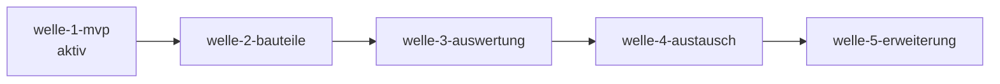

# Roadmap — b-cad

**Status:** Aktiv. **Letzte Änderung:** 2026-06-11.

**Format-Regel:** Reihenfolge von **Wellen**, keine Reihenfolge von
Terminen. Daten sind Schätzungen, korrigierbar. Die Roadmap entstand im
Greenfield-Bootstrap (Kurs-Modul 2, Schritt 5) — sie ist eine
Feature-Sequenz, kein Reconciliation-Plan.

---

## Aktuelle Welle

**Welle-ID:** welle-1-mvp
**Start:** 2026-06-08
**Geplantes Ende:** offen (Schätzung folgt mit der Slice-Zerlegung)

**Welle-Ziel:** Ein lauffähiges b-cad, mit dem sich ein
Einfamilienhaus im Sinne von ACC-001 in Grundzügen erstellen lässt —
Projekt anlegen/speichern/laden, Geschosse, Wände (mit Stärke/Höhe),
automatische Raumerkennung, 3D-Extrusion in Echtzeit **als
Kern-Vertrag** (inkrementeller Rebuild + Änderungs-Benachrichtigung,
ADR-0008; die *sichtbare* 3D-Darstellung inkl. ACC-002 liefert
`welle-1v-viewer` — Scope-Entscheidung slice-010a, siehe
Drift-Tabelle).

**Closure-Trigger** (jeder Trigger verweist auf ≥1 Slice mit DoD; „Slice
folgt" = Slice noch in der Welle zu schneiden):
- slice-001 done — Build-Skelett & DevContainer (`make build` grün).
- slice-002 done — Code-Gates real & gepromotet (`make gates` grün).
- slice-003a done — Domain-Kern & Wände mit Grenzwert-Verhalten (`LH-FA-WAL-001/002/003`, `LH-FA-BLD-001`, `LH-FA-FLR-001`), OCC-frei.
- slice-003b done — OCC-Extrusion (`LH-FA-D3-001`) hinter `GeometryKernelPort` + arch-check Regel C (ADR-0002-Folgepflicht erfüllt). Trigger: slice-003a done.
- slice-009a done — ADR-0007 accepted (Innenkante + Ring-Modell, Erkennung total) + Spec-§1-Schärfung Raumerkennung (`LH-FA-ROM-001`).
- slice-009b done — Raum-Autoerkennung implementiert (`LH-FA-ROM-001`): automatisch beim Schließen, Innenkante + Ring-Modell/Netto-Fläche (ADR-0007), 5 AK-Tests grün.
- slice-010a done — LH-FA-D3-002 auf AK-Niveau (lösungsfrei, benutzer-beobachtbar; Lastenheft 0.1.1) + ADR-0008 accepted (Observer-Port, Push-Notify/Pull-State) + spez. §1 D3-002.a.
- slice-010b (`open/`, startbar) — Kern-Benachrichtigung Implementierung (`LH-FA-D3-002`, Qt-/OCC-frei). Trigger: slice-010a done ✓.
- Sichtbarer 3D-Viewer (Qt/OCC, ACC-002): **entschieden (slice-010a)** — eigene Welle `welle-1v-viewer` nach welle-1, *kein* welle-1-Closure-Trigger; ACC-002 und die sichtbare Hälfte von LH-FA-D3-002 werden dort erfüllt.
- slice-008a done — ACC-005 speichern/laden (`LH-FA-BLD-002/003`, atomar via Temp+Rename, Round-Trip grün) hinter `ProjectRepositoryPort` (ADR-0003).
- slice-008b done — Persistenz-Härtung: Crash-Recovery (`kill -9`, LH-QA-005, fork+SIGKILL-Test) + Fehlercodes `E-IO-001`/`E-IO-002`. Schließt die ADR-0003-Folgepflicht.
- slice-004 done — reproduzierbare, gepinnte Toolchain (ADR-0004): Migration 26.04/node24, Digest+Snapshot, `make versions`-Beleg. (Toolchain-Härtung; gatet nicht die Feature-Funktion, aber den reproduzierbaren MVP-Build.)
- slice-007 done — Datenmodell-Definition (`spec/data-model.yaml`, d-migrate-validiert) + ADR-0006 (relationales Schema). (Spec-Grundlage für Persistenz/Bauteile; gatet nicht die Feature-Funktion.)
- Closure-Notiz in `done/welle-1-results.md`.

## Nächste Wellen

| Welle | Trigger | Wichtigste Slices (geplant) | Geschätzter Aufwand |
|---|---|---|---|
| welle-1v-viewer | welle-1 done | GUI-Grundsatz-ADR (Qt 6, Driving Adapter) + 3D-Viewer-Adapter auf ADR-0008-Basis (ACC-002, sichtbare Hälfte `LH-FA-D3-002`) | M |
| welle-2-bauteile | welle-1 done | Türen/Fenster mit Wandöffnung (`DOR`,`WIN`), Treppen (`STR`), Decken/Dach (`SLB`,`ROF`) | L |
| welle-3-auswertung | welle-2 done | Material (`MAT`), Auswertungen (`EVL`), Bemaßung/Layer (`DRW`) | M |
| welle-4-austausch | welle-3 done + ADR zu IFC-Bibliothek accepted | IFC/DXF/STEP/STL-Adapter (`IO`), PDF/PNG-Export | L |
| welle-5-erweiterung | welle-4 done | Plugin-System (`PLG`), UI-Themes/Docking (`UI`), Mehrsprachigkeit (`LH-QA-006`) | M |

## Meilensteine

| Meilenstein | Welle(n) | Trigger | Status |
|---|---|---|---|
| M1 — Lauffähiges MVP | welle-1-mvp | ACC-001-Kern erstellbar, `make gates` grün | offen |
| M2 — Vollständige Bauteile | welle-2-bauteile | Haus mit Türen, Fenstern, Dach vollständig | offen |
| M3 — Auswertbar | welle-3-auswertung | Flächen/Volumen/Materiallisten korrekt | offen |
| M4 — Offen austauschbar | welle-4-austausch | ACC-003, ACC-004 erfüllt | offen |
| M5 — Erweiterbar | welle-5-erweiterung | OBJ-004 (Plugins) erfüllt | offen |

## Abhängigkeitsgraph

## Abgeschlossene Wellen

(noch keine — Greenfield-Bootstrap soeben abgeschlossen)

## Historische Trigger-Verschiebungen

| Datum | Was wurde geändert? | Warum? |
|---|---|---|
| 2026-06-09 | `slice-003` in `slice-003a` (Kern, OCC-frei) + `slice-003b` (OCC-Extrusion + arch-check Regel C) geschnitten | Slice zu groß für eine Review-Sitzung (Modul 5); OCC-Teil ist build-schwer/risikobehaftet und wird isoliert. ADR-0002 dabei auf Backend-Scope verengt + accepted (slice-003-Review, Findings 1–3). |
| 2026-06-11 | `slice-009` in `slice-009a` (ADR-0007 + Spec-Schärfung) + `slice-009b` (Implementierung + Tests) geschnitten | Plan-Review-Findings H1/M1/M2: ADR-0007 trägt mehr Entscheidungsgewicht als geplant (Polygon-Basis **und** Verschachtelungs-Repräsentation), ADR-Accept ist Review-Checkpoint und gehört nicht mitten in einen Implementierungs-Slice (Präzedenz slice-007, slice-003-Split). |
| 2026-06-11 | Sichtbarer 3D-Viewer aus welle-1 in eigene Welle `welle-1v-viewer` gelöst; Welle-Ziel und Viewer-Trigger-Zeile angepasst | Scope-Entscheidung slice-010a: GUI-Grundsatz-ADR (Qt 6) fehlt noch, M1-Trigger (ACC-001-Kern + Gates) verlangt keinen Viewer; ACC-002 wird in `welle-1v-viewer` erfüllt — kein stilles `done` über den Kern-Vertrag (Lastenheft-Wortlaut „sichtbar" bleibt unverändert benutzer-beobachtbar). |
