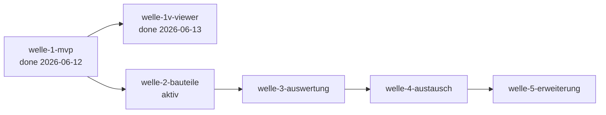

# Roadmap — b-cad

**Status:** Aktiv. **Letzte Änderung:** 2026-06-13.

**Format-Regel:** Reihenfolge von **Wellen**, keine Reihenfolge von
Terminen. Daten sind Schätzungen, korrigierbar. Die Roadmap entstand im
Greenfield-Bootstrap (Kurs-Modul 2, Schritt 5) — sie ist eine
Feature-Sequenz, kein Reconciliation-Plan.

---

## Aktuelle Welle

**Welle-ID:** welle-2-bauteile
**Start:** 2026-06-13 (bewusste Planungs-Entscheidung nach
welle-1v-Closure, [`../done/welle-1v-results.md`](../done/welle-1v-results.md))
**Geplantes Ende:** offen (Aufwands-Schätzung L)

**Welle-Ziel:** Alle parametrischen Bauteile über die Wände hinaus —
**Türen + Fenster** (mit automatischer Wandöffnung), **Treppen**,
**Dach**, **Decken**, **Fundament**. Jedes Modul wird vom Lastenheft-
Outline auf AK-Niveau geschärft (Reifephase-Klausel), spezifiziert,
hinter den bestehenden Ports (`EditStructurePort`/`GeometryKernelPort`)
implementiert, folgt im Viewer (ADR-0008/0009-Vertrag) und persistiert
(ADR-0006-Schema). Erfüllt **Meilenstein M2** und die Bauteil-Hälfte von
**ACC-001** (Türen/Fenster/Dach) sowie STR/SLB/FND darüber hinaus.
Scope-Entscheidung 2026-06-13: **alle Bauteil-Module** in einer Welle
(thematisch geschlossen); das Welle-Sizing wird über kleine, einzeln
MR-006-plan-reviewte Slices gehalten, nicht über Welle-Verkleinerung.

**Closure-Trigger** (deliverable-granular; konkrete Slices emergieren
mit MR-006-Plan-Review, erster Slice steht):
- **slice-013a done** — ADR-0011 „Bauteil-Hosting & Wandöffnungs-Modell"
  accepted (Hosting, Öffnungs-Boolean, Notification, Persistenz +
  verallgemeinertes Bauteil-Erweiterungs-Muster als Welle-Leitplanke) +
  Lastenheft DOR/WIN von Outline auf AK geschärft + Spec-Algorithmus.
  **done 2026-06-13** (in `done/`; ADR-0011 accepted nach unabhängigem
  Text-Review, `make gates` grün) → slice-013b (Türen/Fenster
  implementieren) startbar.
- **Türen + Fenster** (LH-FA-DOR-001..004, LH-FA-WIN-001..005):
  **slice-013b done 2026-06-13** — platzieren/verschieben/Parameter,
  automatische Wandöffnung sichtbar (boolesche Subtraktion), AK-Tests
  mit `LH-`-ID, Viewer folgt; `make gates` grün. **slice-013c done
  2026-06-13** — Öffnungs-Persistenz (`openings`/`doors`/`windows`-
  Round-Trip); **ADR-0011 vollständig umgesetzt**. Türen/Fenster damit
  abgeschlossen (Code-Review zu 013b gelaufen).
- **Dach** (LH-FA-ROF-001..005): Sattel-/Walm-/Pultdach, Neigung,
  Überstand. **slice-014a done 2026-06-13** — Lastenheft auf AK
  geschärft (Teilumfang Rechteck-Grundriss) + Spec-Geometrie.
  **slice-014b done 2026-06-13** — Sattel/Walm/Pult implementiert
  (analytisches Dach-Netz im Kern, Viewer folgt); **slice-014c done
  2026-06-13** — Dach-Persistenz (`roofs`/`footprint_json`-Round-Trip).
  **Dach-Familie (014a/b/c) komplett**, Code-Review zu 014b gelaufen.
- **Decken + Fundament** (LH-FA-SLB-001..003, LH-FA-FND-001..003):
  Platten-Solids mit Ausschnitten. **slice-015a done 2026-06-13** —
  Lastenheft auf AK geschärft + Spec-Platten-Geometrie (Polygon × Dicke,
  Ausschnitte als Boolean, base_z je Typ). **slice-015b done
  2026-06-13** — Platten implementiert: Extrusion + Mesh-Translation
  auf base_z (Port unverändert, 015a-HIGH-1 gelöst), Cutout-Boolean,
  `SlabChanged`-Viewer (`reloadKeyed`). **slice-015c done 2026-06-14** —
  Platten-Persistenz (`slabs`/`polygon_json` mit Grundriss- **und**
  Cutout-Ringen, Round-Trip; verschachteltes Format generalisiert das
  014c-Flach-Array). **Platten-Familie (015a/b/c) komplett.**
- **Treppen** (LH-FA-STR-001..004) inkl. Geländer — letztes welle-2-Bauteil.
  **slice-016a done 2026-06-14** — Lastenheft STR-001..004 auf AK geschärft
  (**Teilumfang gerade einläufige Treppe**, Stufenanzahl 2–30, Laufbreite
  800–2000 mm, immer sichtbares Geländer) + Spec `LH-FA-STR-001.a`
  (analytisches Stufen-Polyeder, `rise = Geschosshöhe/step_count` abgeleitet,
  feste +x-Richtung, `StairChanged` an `from_storey`) + §3-Konstanten;
  zugleich Lastenheft-Header-Versions-Drift behoben (0.1.2 → 0.1.6).
  **slice-016b done 2026-06-14** — Treppen implementiert (in-memory): `model::Stair`
  + pure `stair_geometry` (analytisches Stufen-Quader-Polyeder + beidseitiges
  Geländer im Kern, **kein OCC**; rise abgeleitet), `ViewModelPort.stairMeshes`,
  Edit-Ops (Klemmung, ungültige Spanne abgelehnt), `StairChanged`-Viewer über
  `reloadKeyed`; 7 AK-Tests, Zwei-Commit-Split. **slice-016c done 2026-06-14** —
  Treppen-Persistenz (`stairs`-Round-Trip; `rise_mm` write-derived via
  `stairRiseMm`/nicht round-getrippt, Geländer render-only; from/to_storey
  RESTRICT). **Treppen-Familie (016a/b/c) komplett — STR war das letzte
  welle-2-Bauteil → welle-2 closure-reif.**
- Unabhängige Welle-Verifikation (analog welle-1/-1v) + Closure-Notiz in
  `done/welle-2-results.md` inkl. zwingendem Carveout-Audit.

## Nächste Wellen

| Welle | Trigger | Wichtigste Slices (geplant) | Geschätzter Aufwand |
|---|---|---|---|
| welle-3-auswertung | welle-2 done | Material (`MAT`), Auswertungen (`EVL`), Bemaßung/Layer (`DRW`) | M |
| welle-4-austausch | welle-3 done + ADR zu IFC-Bibliothek accepted | IFC/DXF/STEP/STL-Adapter (`IO`), PDF/PNG-Export | L |
| welle-5-erweiterung | welle-4 done | Plugin-System (`PLG`), UI-Themes/Docking (`UI`), Mehrsprachigkeit (`LH-QA-006`) | M |

## Meilensteine

| Meilenstein | Welle(n) | Trigger | Status |
|---|---|---|---|
| M1 — Lauffähiges MVP | welle-1-mvp | ACC-001-Kern erstellbar, `make gates` grün | erreicht (2026-06-12; Viewer per Drift-Entscheidung 2026-06-11 nicht Teil des Triggers) |
| M2 — Vollständige Bauteile | welle-2-bauteile | Haus mit Türen, Fenstern, Dach vollständig | offen |
| M3 — Auswertbar | welle-3-auswertung | Flächen/Volumen/Materiallisten korrekt | offen |
| M4 — Offen austauschbar | welle-4-austausch | ACC-003, ACC-004 erfüllt | offen |
| M5 — Erweiterbar | welle-5-erweiterung | OBJ-004 (Plugins) erfüllt | offen |

## Abhängigkeitsgraph

## Abgeschlossene Wellen

| Welle | Zeitraum | Ergebnis | Closure-Notiz |
|---|---|---|---|
| welle-1-mvp | 2026-06-08 – 2026-06-12 | Kern-MVP als Vertrag: Projekt anlegen/speichern/laden (atomar + Crash-Recovery), Geschosse, Wände, Raum-Autoerkennung, OCC-Extrusion + Echtzeit-Benachrichtigung; 13 Slices + spike-001 in `done/`; Review + Verifikation gelaufen, Findings behoben (`330d5d0`). Sichtbarer Viewer → `welle-1v-viewer`. | [`../done/welle-1-results.md`](../done/welle-1-results.md) |
| welle-1v-viewer | 2026-06-12 – 2026-06-13 | Sichtbare Hälfte des Echtzeit-Vertrags: Qt-6-3D-Viewer (Driving Adapter) stellt das extrudierte Gebäudemodell dar und folgt committeten Änderungen — **ACC-002 erfüllt** + sichtbare Hälfte LH-FA-D3-002; slice-011a/011b + slice-012 (Eckenschluss WAL-006-Teilumfang) in `done/`. Unabhängige Verifikation gelaufen (keine HIGH/MEDIUM, 1 LOW); `make gates` grün am HEAD (63/63, Coverage 94,2 %). | [`../done/welle-1v-results.md`](../done/welle-1v-results.md) |

## Historische Trigger-Verschiebungen

| Datum | Was wurde geändert? | Warum? |
|---|---|---|
| 2026-06-09 | `slice-003` in `slice-003a` (Kern, OCC-frei) + `slice-003b` (OCC-Extrusion + arch-check Regel C) geschnitten | Slice zu groß für eine Review-Sitzung (Modul 5); OCC-Teil ist build-schwer/risikobehaftet und wird isoliert. ADR-0002 dabei auf Backend-Scope verengt + accepted (slice-003-Review, Findings 1–3). |
| 2026-06-11 | `slice-009` in `slice-009a` (ADR-0007 + Spec-Schärfung) + `slice-009b` (Implementierung + Tests) geschnitten | Plan-Review-Findings H1/M1/M2: ADR-0007 trägt mehr Entscheidungsgewicht als geplant (Polygon-Basis **und** Verschachtelungs-Repräsentation), ADR-Accept ist Review-Checkpoint und gehört nicht mitten in einen Implementierungs-Slice (Präzedenz slice-007, slice-003-Split). |
| 2026-06-11 | Sichtbarer 3D-Viewer aus welle-1 in eigene Welle `welle-1v-viewer` gelöst; Welle-Ziel und Viewer-Trigger-Zeile angepasst | Scope-Entscheidung slice-010a: GUI-Grundsatz-ADR (Qt 6) fehlt noch, M1-Trigger (ACC-001-Kern + Gates) verlangt keinen Viewer; ACC-002 wird in `welle-1v-viewer` erfüllt — kein stilles `done` über den Kern-Vertrag (Lastenheft-Wortlaut „sichtbar" bleibt unverändert benutzer-beobachtbar). |
| 2026-06-12 | `welle-1v-viewer` um slice-012 erweitert (Eckenschluss endpunkt-verbundener Wände, LH-FA-WAL-006-Teilumfang); slice-011b-Abnahme (DoD-4) auf den regenerierten Beleg verschoben | Abnahme-Befund des Projektinhabers am ACC-002-Beleg: Wände schließen an Außenecken nicht (fehlendes ½×½-Stärke-Quadrat, [Befund-2D](../done/acc-002-befund-2d-ecken.png)) — modell-treu gerendert, aber als Abnahme-Artefakt nicht tragfähig; WAL-006-Teilumfang wird vorgezogen statt die Grenze nur zu dokumentieren. |
