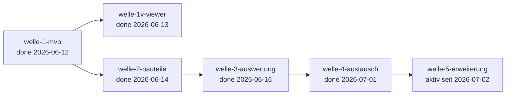

# Roadmap — b-cad

**Status:** Aktiv. **Letzte Änderung:** 2026-07-23.

**Format-Regel:** Reihenfolge von **Wellen**, keine Reihenfolge von
Terminen. Daten sind Schätzungen, korrigierbar. Die Roadmap entstand im
Greenfield-Bootstrap (Kurs-Modul 2, Schritt 5) — sie ist eine
Feature-Sequenz, kein Reconciliation-Plan.

---

## Aktuelle Welle

<!-- planning-Gate: der reservierte Ruhe-Sentinel steht in DIESEM Block genau dann, wenn
     in-progress/ keinen Slice-Plan enthaelt; beim Oeffnen des ersten / Schliessen des letzten
     Slice im selben Commit wie der git mv toggeln (siehe planning-README, Abschnitt Ruhe-Marker).
     Den exakten Sentinel-String NIE als Prosa in diesem Block verwenden (Fehl-Match). -->

**Welle-ID:** welle-5-erweiterung
**Zeitraum:** ab 2026-07-02 (Ziel: Meilenstein M5 „Erweiterbar")

**In Arbeit:** [`slice-047`](slice-047-projekt-oeffnen.md) — Projekt speichern/öffnen benutzer-erfüllbar.
**047a (CLI + Kern-Naht) done** (`70a30f1`); **047b (GUI) implementiert** (`15448d2`) — Datei-Menü +
Datei-Auswahl, `openProject`-Naht, `replaceBuilding` (abgeleitete Zustände + Id-Zähler-Reset),
`ModelReplaced`-Op + Viewer-Voll-Neuaufbau, Neu-Auflösung der eingefrorenen Geschoss-/Ebenen-Ids.
**Unabhängiges Code-Review** (1 HIGH / 10 MED / 6 LOW / 4 INFO) **vollständig eingearbeitet**
(`2db4fc6`, `17da627`). **Offen: Verify + Validation + Closure** — s. §Tagesabschluss.

## Tagesabschluss 2026-07-25 — Stand + nächste-Sitzung-Zeiger

`make gates` **EXIT=0** (docs-check 0 Befunde / 246 Dateien · a-check 0 · arch-check ok ·
**280/280** Tests · Coverage 91,4 %). Alles committet; **lokal auf `main`, Push nach eigenem Ermessen.**

### Was heute fertig wurde

- **[`slice-050`](../done/slice-050-tooling-konsolidierung-dcheck.md) GESCHLOSSEN** — Tooling-Konsolidierung.
  `gate-consistency.sh` + `idlink.py` retired (d-check-Modul `targets` bzw. `make doc-repair`);
  **arch-check-Regel P1** → a-check **v0.16.0 `constructs`**. `tools/arch-check.sh` **lebt weiter** mit
  Regel **P2** (geschlossene Import-Allowlist, kanten-basiert nicht abbildbar). Zwei neue MRs
  ([MR-021](../../../../harness/conventions.md) P1, [MR-022](../../../../harness/conventions.md) targets/repair);
  **keine** Gate-Lockerung ⇒ kein ADR.
- **slice-047b implementiert** + Code-Review vollständig eingearbeitet (s. o.).

### Wo morgen angesetzt wird — Reihenfolge zwingend

1. **Verify-Findings einarbeiten** — Report liegt:
   [`2026-07-25-slice-047-verify.md`](../../../reviews/2026-07-25-slice-047-verify.md).
   **Verdikt: nicht fertig.** 11 DoD-Zeilen — **8 bestätigt, 0 widerlegt, 3 unbelegt**. Die Zeilen
   sind also nicht falsch, aber drei tragen kein Orakel. Offen:
   - **B4 (unbelegt):** `reresolve_after_open()` in `main.cpp` wird von **keinem** Sensor ausgeführt
     (main.cpp ist in kein Testbinary gelinkt, coverage-ausgenommen, `io-smoke` kehrt vor dem
     GUI-Aufbau zurück). Gegenprobe des Verifiers: Aufruf entfernt → **280/280 grün**. Der
     Adapter-Test ruft die Setter selbst nach, prüft also nicht den Produktions-Aufruf.
   - **B5 (unbelegt):** das Datei-Menü selbst hat keinen Sensor (modaler Dialog, bewusst).
   - **B2 (teil-ungedeckt):** die Zusage „**jeden** Id-Zähler" ist nur für 5 von 9 diskriminierend —
     Resets für opening/roof/slab/stair entfernt → 280/280 grün.
   - **C1 (erledigt 2026-07-25):** die Spec normierte die Export-Quelle als „via `--open`/**GUI**
     geöffnetes Projekt" — einen GUI-Export gibt es **nicht**. Stammte aus `70a30f1`, korrigiert.
   - **Anforderungs-Ebene:** trägt für [`LH-FA-BLD-002`](../../../../spec/lastenheft.md#lh-fa-bld-002--projekt-speichern).
     Für [`LH-FA-BLD-003`](../../../../spec/lastenheft.md#lh-fa-bld-003--projekt-laden) ist die Korrektur
     **formal unbelegbar**, solange die Anforderung im Lastenheft **Outline ohne AK** ist — „benutzer-
     erfüllbar?" hat dort kein Maß. **Entscheidung nötig:** AK-Schärfung nachziehen (Muster slice-048a,
     [MR-008](../../../../harness/conventions.md#mr-008--lastenheft-schärfung-bleibt-lösungsfrei)) oder
     die Grenze im Closure-Text benennen.
2. **Validation** (Rolle: **Projektinhaber**, [`.harness/skills/validator.md`](../../../../.harness/skills/validator.md)).
   Übergabe-Artefakt nach Modul 8: Build-Ergebnis + Slice-Resultat. Konkret die Frage, die weder
   Review noch Verify beantworten: *ist Projekt-Öffnen so, wie es jetzt ist, für einen Benutzer
   brauchbar?* Die Entscheidung geht in die Closure-Notiz.
3. **Closure slice-047:** §8-Notiz, `git mv` `in-progress/` → `done/` **mit** Ruhe-Sentinel-Toggle im
   **selben** Commit ([MR-017](../../../../harness/conventions.md), [AGENTS §2.8](../../../../AGENTS.md)),
   Roadmap nachziehen. Achtung: der Sentinel muss beim Schließen **zurück** in den
   `## Aktuelle Welle`-Block (heute wurde er beim Öffnen entfernt).

### Danach frei wählbar

- **[`slice-049`](../open/slice-049-spec-straten-prozess-rein-welle.md)** (welle-Purge + `matrix`-Härtung) —
  berührt `.d-check.yml`, das slice-050 heute umgebaut hat: **Konflikte prüfen**.
- **[`slice-051`](../open/slice-051-review-artefakt-pflicht.md)** (neu, Skelett) — Review-Artefakt-Pflicht
  computational. **Offene Frage vom Projektinhaber:** ob dieser Slice auch die **fehlenden Rollen-Skills**
  (Planner/Architect/Implementation) aufnimmt oder ob dafür ein eigener Slice geschnitten wird.
- **slice-048b** (DRW-001-Impl) — der eigentliche Feature-Fortschritt der DRW-Kampagne.

### ⚠ Offener Klärungspunkt: Fremd-Änderungen in `17da627`

Der Commit `17da627` (Titel: Code-Review-Findings) enthält Änderungen, die **nicht** zum Slice gehören
und **nicht** vom Implementer stammen: `roadmap.md` wurde von 372 auf 94 Zeilen gekürzt und der Inhalt in
zwei **neue, von nirgends verlinkte** Dateien ausgelagert — `status.md` und **`d-ckeck.md`**
(Tippfehler im Dateinamen). Ursache: ein `git add -A` des Implementers hat parallel im Arbeitsbaum
entstandene Fremd-Änderungen mitgenommen; die Commit-Message beschreibt sie nicht.

**Zu klären (Projektinhaber):** stammen `status.md`/`d-ckeck.md` von dir, und sollen sie bleiben? Falls
ja: Tippfehler im Dateinamen korrigieren und beide verlinken (sonst sind es tote Dokumente — kein Gate
fängt eine unverlinkte, aber existierende Datei). Falls nein: Revert des Doku-Teils von `17da627`.
**Lehre für den Implementer:** kein `git add -A`, wenn der Arbeitsbaum fremde Änderungen tragen kann —
Pfade einzeln stagen.

### Prozess-Befunde von heute (Alt-Last, bewusst NICHT geheilt)

- **Fehlende Plan-Review-Reports** für slice-045/046a/046b/047: die Pläne behaupten
  [MR-006](../../../../harness/conventions.md#mr-006--unabhängiges-plan-review-vor-implementierungs-start)-Ergebnisse,
  ohne dass ein Artefakt unter `docs/reviews/` liegt. Regelwerk **Modul 10** verlangt „ein Report **pro
  Lauf**". Rückwirkende Reports wären eine **Fälschung der Audit-Spur** — sie werden nicht geschrieben;
  der Gate-Nachzug liegt in slice-051.
- **Negativbefund-Zeilen** („geprüft, ohne Befund") tragen nur **13 von 101** Alt-Reports. Die neuen
  Skills fordern sie ein; der Alt-Bestand bleibt, wie er ist (dieselbe Fälschungs-Grenze).
- **Rollen-Skills** nach Modul 8 (»eine Person darf alle Rollen spielen — aber mit unterschiedlichen
  Skill-Dateien«): **Reviewer · Verifier · Validator** liegen jetzt unter `.harness/skills/`;
  **Planner · Architect · Implementation** fehlen noch. Deren Inhalte überschneiden sich stark mit
  `AGENTS.md` (das laut Modul 9 ohnehin in **jeden** Lauf-Kontext gehört) — die zu entscheidende Frage
  ist **Delta vs. Duplikat**, nicht ob.
- **Kein `make verify`-Target.** Modul 11 zeigt das Muster (DoD-Aussage → Operationalisierung →
  `verify-*`-Sub-Target, bewusst **nicht** in `make gates`). Die DoD-Prüfung ist derzeit rein
  inferentiell — laut Modul 11 „die am wenigsten ausgereifte" Schicht.

### Werkzeug-Lehren von heute (nicht wieder herleiten)

- Der **wirksame `A_CHECK_IMAGE`-Pin** steht im `Makefile`, **nicht** in `a-check.mk`: die Zuweisung
  steht **vor** dem `include`, dessen `?=` ist ein No-op. `make -n a-check` zeigt die Wahrheit.
- **`constructs.adapter` ist ein Teilstring-Vergleich** → Zone **mit Schrägstrich** notieren.
- **`make doc-repair | git apply` scheitert** (kontextlose Hunks) → `git apply --unidiff-zero`; der Patch
  ist **sichtprüfpflichtig** (verlinkt aufs Verzeichnis, repo-fremde Kennungen falsch).
- **`ignore-refs` ist seit d-check v0.49.0 querschnittlich** (`links`/`anchors`/`codepaths`) — damit sind
  Referenzen aus **unveränderlichen** MR/ADR tombstone-bar, ohne sie zu editieren.
- **Regelwerk-Bezug:** gepinnte Release-ZIP `lab-regelwerk.zip` (v1.3.0) ziehen und selbst lesen. Die
  Migration auf **v3.5.2** steht aus; bis dahin ist die committet-vendored Baseline nach u-boot-Muster
  **zurückgestellt** (Projektinhaber 2026-07-25).

## Nächste Wellen

Keine Folge-Welle benannt — die nächste Welle nach M5 ist eine
**Planungs-Entscheidung** (kein Automatismus). Benannte Kandidaten-Themen aus
den Re-Eval-Trägern der welle-3/-4-Closures: Format-Reichtum (IFC-/DXF-
Bibliothek, PDF-Fit-to-Page/Bemaßung), Wandtyp-Bibliothek (`wall_type`-
Template-Fallback), Observability (`TracingPort`-Anbindung), Drittanbieter-
Attribution (slice-006 in `open/`).

## Meilensteine

| Meilenstein                | Welle(n)            | Trigger                                                                                                                            | Status                                                                                                                                                                                                                                                                                           |
| -------------------------- | ------------------- | ---------------------------------------------------------------------------------------------------------------------------------- | ------------------------------------------------------------------------------------------------------------------------------------------------------------------------------------------------------------------------------------------------------------------------------------------------ |
| M1 — Lauffähiges MVP       | welle-1-mvp         | [ACC-001](../../../../spec/lastenheft.md#7-abnahmekriterien)-Kern erstellbar, `make gates` grün                                    | erreicht (2026-06-12; Viewer per Drift-Entscheidung 2026-06-11 nicht Teil des Triggers)                                                                                                                                                                                                          |
| M2 — Vollständige Bauteile | welle-2-bauteile    | Haus mit Türen, Fenstern, Dach vollständig                                                                                         | **erreicht** (2026-06-14; vier Bauteil-Familien geliefert + Decken/Fundament/Treppen, welle-2-Closure)                                                                                                                                                                                           |
| M3 — Auswertbar            | welle-3-auswertung  | Flächen/Volumen/Materiallisten korrekt                                                                                             | **erreicht** (2026-06-16; `EvaluatePort` Flächen/Volumen/Wohnfläche + Material-/Kosten-/Tür-/Fensterlisten analytisch im Kern, welle-3-Closure)                                                                                                                                                  |
| M4 — Offen austauschbar    | welle-4-austausch   | [ACC-003](../../../../spec/lastenheft.md#7-abnahmekriterien), [ACC-004](../../../../spec/lastenheft.md#7-abnahmekriterien) erfüllt | **erreicht** (2026-07-01; alle sechs Austauschformate IFC/DXF/STEP/STL/PDF/PNG hinter Driven-Adaptern, [ACC-003](../../../../spec/lastenheft.md#7-abnahmekriterien) IFC-Export-Roundtrip + [ACC-004](../../../../spec/lastenheft.md#7-abnahmekriterien) maßstäblicher PDF-Plan, welle-4-Closure) |
| M5 — Erweiterbar           | welle-5-erweiterung | [OBJ-004](../../../../spec/lastenheft.md#3-projektziele) (Plugins) erfüllt                                                         | offen                                                                                                                                                                                                                                                                                            |

## Abhängigkeitsgraph

```mermaid
flowchart LR
    W1[welle-1-mvp<br/>done 2026-06-12]
    W1V[welle-1v-viewer<br/>done 2026-06-13]
    W2[welle-2-bauteile<br/>done 2026-06-14]
    W3[welle-3-auswertung<br/>done 2026-06-16]
    W4[welle-4-austausch<br/>done 2026-07-01]
    W5[welle-5-erweiterung<br/>aktiv seit 2026-07-02]

    W1 --> W1V
    W1 --> W2 --> W3 --> W4 --> W5
```

## Abgeschlossene Wellen

| Welle              | Zeitraum                | Ergebnis                                                                                                                                                                                                                                                                                                                                                                                                                                                                                                                                                                                                                                                                                                                                                                                                                                                                                                                                                                                                                                                                                                                                                                                                                                                                    | Closure-Notiz                                                |
| ------------------ | ----------------------- | --------------------------------------------------------------------------------------------------------------------------------------------------------------------------------------------------------------------------------------------------------------------------------------------------------------------------------------------------------------------------------------------------------------------------------------------------------------------------------------------------------------------------------------------------------------------------------------------------------------------------------------------------------------------------------------------------------------------------------------------------------------------------------------------------------------------------------------------------------------------------------------------------------------------------------------------------------------------------------------------------------------------------------------------------------------------------------------------------------------------------------------------------------------------------------------------------------------------------------------------------------------------------- | ------------------------------------------------------------ |
| welle-1-mvp        | 2026-06-08 – 2026-06-12 | Kern-MVP als Vertrag: Projekt anlegen/speichern/laden (atomar + Crash-Recovery), Geschosse, Wände, Raum-Autoerkennung, OCC-Extrusion + Echtzeit-Benachrichtigung; 13 Slices + spike-001 in `done/`; Review + Verifikation gelaufen, Findings behoben (`330d5d0`). Sichtbarer Viewer → `welle-1v-viewer`.                                                                                                                                                                                                                                                                                                                                                                                                                                                                                                                                                                                                                                                                                                                                                                                                                                                                                                                                                                    | [`../done/welle-1-results.md`](../done/welle-1-results.md)   |
| welle-1v-viewer    | 2026-06-12 – 2026-06-13 | Sichtbare Hälfte des Echtzeit-Vertrags: Qt-6-3D-Viewer (Driving Adapter) stellt das extrudierte Gebäudemodell dar und folgt committeten Änderungen — **[ACC-002](../../../../spec/lastenheft.md#7-abnahmekriterien) erfüllt** + sichtbare Hälfte [LH-FA-D3-002](../../../../spec/lastenheft.md#lh-fa-d3-002--echtzeitaktualisierung); slice-011a/011b + slice-012 (Eckenschluss WAL-006-Teilumfang) in `done/`. Unabhängige Verifikation gelaufen (keine HIGH/MEDIUM, 1 LOW); `make gates` grün am HEAD (63/63, Coverage 94,2 %).                                                                                                                                                                                                                                                                                                                                                                                                                                                                                                                                                                                                                                                                                                                                           | [`../done/welle-1v-results.md`](../done/welle-1v-results.md) |
| welle-2-bauteile   | 2026-06-13 – 2026-06-14 | **Alle parametrischen Bauteile** über die Wände hinaus: Türen/Fenster (automatische Wandöffnung, OCC-Boolean), Dach (Sattel/Walm/Pult), Decken/Fundament (Platten + Ausschnitte), Treppen (gerade einläufig) — je Familie Lastenheft-AK-Schärfung + Implementierung (Domäne/Geometrie/Viewer/Edit-Ops) + Persistenz; **12 Slices** in `done/`, **[ADR-0011](../../adr/0011-bauteil-hosting-wandoeffnung.md) (#6)-Leitplanke** über vier Familien. **Meilenstein M2 erreicht** + [ACC-001](../../../../spec/lastenheft.md#7-abnahmekriterien)-Bauteil-Hälfte. Unabhängige Verifikation (keine HIGH, 1 MED/1 LOW behoben) + Carveout-Audit (keine aktiven); `make gates` grün am HEAD `d7073fb` (116/116, Coverage 92,3 %). Geometrielastige Code-Reviews je Familie (013b/014b/015b je 1 HIGH gefixt, 016b keine HIGH).                                                                                                                                                                                                                                                                                                                                                                                                                                                      | [`../done/welle-2-results.md`](../done/welle-2-results.md)   |
| welle-3-auswertung | 2026-06-14 – 2026-06-16 | **Gebäudemodell auswertbar** ([ADR-0012](../../adr/0012-evaluations-architektur.md) `EvaluatePort` read-only/pull, **kein** `GeometryKernelPort`/`Solid.volume_mm3`): Flächen EVL-001/003 (Shoelace-Raum-Netto + Wohnfläche), **Volumen EVL-002 analytisch im Kern** (Wand/Decke/Treppe; Dach dicke-los → benannte Lücke), **Material-System** MAT-001/002/003/005/006 (projekt-eigen über `EditStructurePort`, `restrict`-treu, NULL-sicher round-trippt über SQLite), **Listen** EVL-004/005/006 (Material-Menge=Σ Netto-Volumen, Tür-/Fensterlisten) + **Kosten MAT-006** (`Menge × cost_per_m3`); `wall_type`-Template-Fallback bewusst zurückgestellt (welle-4+). **7 Slices** (017a–017g) in `done-archive/`. **Meilenstein M3 erreicht**. Unabhängige Verifikation (0 HIGH, 1 LOW behoben) + Carveout-Audit (keine aktiven); `make gates` grün am HEAD (145/145, Coverage 92,7 %), `make schema-check` grün.                                                                                                                                                                                                                                                                                                                                                         | [`../done/welle-3-results.md`](../done/welle-3-results.md)   |
| welle-4-austausch  | 2026-06-16 – 2026-07-01 | **b-cad offen austauschbar** ([OBJ-005](../../../../spec/lastenheft.md#3-projektziele)): **alle sechs Austauschformate** hinter Driven-Adaptern (Kern format-frei) — **IFC** Import+Export ([ADR-0013](../../adr/0013-ifc-bibliothek.md) SPF-Subset-Codec Option D, [ACC-003](../../../../spec/lastenheft.md#7-abnahmekriterien)-Roundtrip), **STEP/STL** Export ([ADR-0014](../../adr/0014-step-stl-export-backend.md) OCC-DataExchange nativ, B-Rep **aller** 3D-Bauteile via 024a/b), **DXF** Import+Export ([ADR-0015](../../adr/0015-dxf-backend.md) 2D-Subset-Codec Option D + Kern-`ImporterMap`), **PDF** ([ADR-0016](../../adr/0016-pdf-png-backend.md) self-rolled Vektor-Maßstabsplan, [ACC-004](../../../../spec/lastenheft.md#7-abnahmekriterien)) + **PNG** (self-rolled Raster-Grundriss). Nebenbei **Dach-Volumen** ([LH-FA-ROF-006](../../../../spec/lastenheft.md#lh-fa-rof-006), erste Repo-Schema-Änderung) + **io-smoke** (CI-Sensor). **16 Slices** (019a–025c) in `done-archive/`, vier Backend-ADRs (0013–0016). **Meilenstein M4 erreicht.** Unabhängige Verifikation (0 HIGH, 1 LOW außerhalb Scope belassen) + Carveout-Audit (keine aktiven); `make gates` grün am HEAD (220/220, Coverage 90,7 %), `make schema-check` + `make io-smoke` grün. | [`../done/welle-4-results.md`](../done/welle-4-results.md)   |

## Historische Trigger-Verschiebungen

| Datum      | Was wurde geändert?                                                                                                                                                                                                                                                                                                                                                                                                                                                                                                                                                                                                                                                                                                                                                                                                                                                                                               | Warum?                                                                                                                                                                                                                                                                                                                                                                                                             |
| ---------- | ----------------------------------------------------------------------------------------------------------------------------------------------------------------------------------------------------------------------------------------------------------------------------------------------------------------------------------------------------------------------------------------------------------------------------------------------------------------------------------------------------------------------------------------------------------------------------------------------------------------------------------------------------------------------------------------------------------------------------------------------------------------------------------------------------------------------------------------------------------------------------------------------------------------- | ------------------------------------------------------------------------------------------------------------------------------------------------------------------------------------------------------------------------------------------------------------------------------------------------------------------------------------------------------------------------------------------------------------------ |
| 2026-06-09 | `slice-003` in `slice-003a` (Kern, OCC-frei) + `slice-003b` (OCC-Extrusion + arch-check Regel C) geschnitten                                                                                                                                                                                                                                                                                                                                                                                                                                                                                                                                                                                                                                                                                                                                                                                                      | Slice zu groß für eine Review-Sitzung (Modul 5); OCC-Teil ist build-schwer/risikobehaftet und wird isoliert. [ADR-0002](../../adr/0002-geometrie-kern-opencascade.md) dabei auf Backend-Scope verengt + accepted (slice-003-Review, Findings 1–3).                                                                                                                                                                 |
| 2026-06-11 | `slice-009` in `slice-009a` ([ADR-0007](../../adr/0007-raumerkennung-geometrie-basis.md) + Spec-Schärfung) + `slice-009b` (Implementierung + Tests) geschnitten                                                                                                                                                                                                                                                                                                                                                                                                                                                                                                                                                                                                                                                                                                                                                   | Plan-Review-Findings H1/M1/M2: [ADR-0007](../../adr/0007-raumerkennung-geometrie-basis.md) trägt mehr Entscheidungsgewicht als geplant (Polygon-Basis **und** Verschachtelungs-Repräsentation), ADR-Accept ist Review-Checkpoint und gehört nicht mitten in einen Implementierungs-Slice (Präzedenz slice-007, slice-003-Split).                                                                                   |
| 2026-06-11 | Sichtbarer 3D-Viewer aus welle-1 in eigene Welle `welle-1v-viewer` gelöst; Welle-Ziel und Viewer-Trigger-Zeile angepasst                                                                                                                                                                                                                                                                                                                                                                                                                                                                                                                                                                                                                                                                                                                                                                                          | Scope-Entscheidung slice-010a: GUI-Grundsatz-ADR (Qt 6) fehlt noch, M1-Trigger ([ACC-001](../../../../spec/lastenheft.md#7-abnahmekriterien)-Kern + Gates) verlangt keinen Viewer; [ACC-002](../../../../spec/lastenheft.md#7-abnahmekriterien) wird in `welle-1v-viewer` erfüllt — kein stilles `done` über den Kern-Vertrag (Lastenheft-Wortlaut „sichtbar" bleibt unverändert benutzer-beobachtbar).            |
| 2026-06-12 | `welle-1v-viewer` um slice-012 erweitert (Eckenschluss endpunkt-verbundener Wände, [LH-FA-WAL-006](../../../../spec/lastenheft.md#lh-fa-wal-006--wand-verbinden)-Teilumfang); slice-011b-Abnahme (DoD-4) auf den regenerierten Beleg verschoben                                                                                                                                                                                                                                                                                                                                                                                                                                                                                                                                                                                                                                                                   | Abnahme-Befund des Projektinhabers am [ACC-002](../../../../spec/lastenheft.md#7-abnahmekriterien)-Beleg: Wände schließen an Außenecken nicht (fehlendes ½×½-Stärke-Quadrat, [Befund-2D](../done/acc-002-befund-2d-ecken.png)) — modell-treu gerendert, aber als Abnahme-Artefakt nicht tragfähig; WAL-006-Teilumfang wird vorgezogen statt die Grenze nur zu dokumentieren.                                       |
| 2026-06-14 | `welle-3-auswertung` gestartet; Scope auf **MAT + EVL** (Auswertungs-Kern, M3) gesetzt, **`DRW` (Bemaßung/Layer/Fangpunkte/Raster/Hilfslinien/Gruppen) nach welle-5 zurückgestellt**                                                                                                                                                                                                                                                                                                                                                                                                                                                                                                                                                                                                                                                                                                                              | Welle-Name + M3-Trigger („Flächen/Volumen/Materiallisten korrekt") zielen auf Auswertung; `DRW` ist 2D-Zeichen-Interaktion (UX) ohne M3-Bezug und passt zu den UI-Werkzeugen von welle-5 — die Trennung hält welle-3 kohärent (Modul-5-Sizing, Auswertung ≠ 2D-Editor).                                                                                                                                            |
| 2026-06-15 | **Quergewerk slice-018a/b/c** eingeschoben (Doku-Referenz-Gate, `harness-steering`): `done-archive/`-Mechanik + Regelwerk-Referenz-Richtung Spec→ADR computational (d-check `matrix`/`ids`, [MR-011](../../../../harness/conventions.md#mr-011--referenz-integritäts-gate-matrix-ids-spans-hostpaths)); **018b** weitet `ids` auf den Voll-Korpus (alle 7 ID-Familien, Linker `tools/idlink.py`), **018c** hebt Bullet-Sub-IDs per Inline-HTML-Anker (d-check v0.9.0) auf präzise Per-ID-Anker. **M3-Scope (MAT+EVL) unberührt.**                                                                                                                                                                                                                                                                                                                                                                                 | d-check-v0.8.0-Hebung stellt `matrix`/`ids`/`spans`/`hostpaths` bereit; die Referenz-Richtung war bis dahin nur inferential ([MR-006](../../../../harness/conventions.md#mr-006--unabhängiges-plan-review-vor-implementierungs-start)-Plan-Review). Quergewerk, kein welle-3-Feature — die Roadmap-Sequenz bleibt unverändert.                                                                                     |
| 2026-06-18 | **Quergewerk io-smoke** (slice-022) eingeschoben: `make io-smoke` — headless Binary-Smoke aller IO-Formate (CI-only, LH-Bindung [LH-FA-IO-001](../../../../spec/lastenheft.md#lh-fa-io-001--ifc-import)…[LH-FA-IO-006](../../../../spec/lastenheft.md#lh-fa-io-006)), belegt die coverage-ausgenommene `main.cpp`-CLI-/Composition-Root-Glue. **welle-4-Scope unberührt.**                                                                                                                                                                                                                                                                                                                                                                                                                                                                                                                                        | Aufkommende Frage „Binary-/CLI-E2E?": die port-tiefe Integration (slice-019–021) deckt die Use-Cases, aber die CLI-/Verdrahtungs-Glue war ungetestet (`main.cpp` coverage-ausgenommen); minimal-additiver Sensor, Muster `acc-002-beleg` — kein welle-Feature, Sequenz unverändert.                                                                                                                                |
| 2026-06-18 | **„STEP-B-Rep Dächer/Treppen" → Dach-Volumen-Initiative re-skopiert** (023a–c, dann 024): der Roadmap-Einzeiler „Mesh→Vernähung" war nicht tragfähig. Erst **Dach-Volumen** (neue [LH-FA-ROF-006](../../../../spec/lastenheft.md#lh-fa-rof-006), Lastenheft 0.1.11), dann STEP für Dächer+Treppen. **welle-4-Sequenz unberührt** (M4-Pfad bleibt [ACC-003](../../../../spec/lastenheft.md#7-abnahmekriterien)/[ACC-004](../../../../spec/lastenheft.md#7-abnahmekriterien)).                                                                                                                                                                                                                                                                                                                                                                                                                                      | [MR-006](../../../../harness/conventions.md#mr-006--unabhängiges-plan-review-vor-implementierungs-start)-Plan-Review zum (verworfenen) STEP-Slice fand **HIGH-1**: die Display-Netze sind **nicht wasserdicht** — `roofMesh` ist eine offene Fläche, `Roof` trägt **kein** Dicke-Feld (dicke-loses Modell) → Vernähung ergäbe ungültige Solids. Projektinhaber wählte „Dach-Volumen zuerst, Regelwerk-konform".    |
| 2026-07-03 | **Quergewerk slice-028/029 eingeschoben (a-check-Vorbereitung, `harness-steering`):** zwei Pilot-Befunde des a-check-Schwester-Tools (v0.8.0) werden b-cad-seitig vor der geplanten Gate-Umstellung (`tools/arch-check.sh` → a-check, eigener Folge-Slice Muster [MR-007](../../../../harness/conventions.md#mr-007--auflösung-von-mr-003-docs-check-via-d-check)) beseitigt: **028** reklassifiziert die fünf reinen Berechnungs-Kerne verzeichnislich nach `src/hexagon/services/geometry/` (Adapter→Service-Includes werden zur deklarierten Kante), **029** trennt den ui-Misch-Adapter in `view/` (driven) + `command/` (driving) mit port-freier `MeshSource`-Naht. **welle-5-Scope unberührt** (Sequenz unverändert; slice-027 lint-Härtung bleibt geparkt startbar).                                                                                                                                      | a-check-Pilot-Lauf des Projektinhabers (2026-07-03) mit verifizierten Befunden; künftige Richtungs-Prüfung schneidet Schichten über Verzeichnis-Globs — beide Umbauten sind Struktur-Voraussetzung des Pilot-Schnitts, kein Wellen-Feature.                                                                                                                                                                        |
| 2026-07-04 | **Quergewerk slice-030 eingeschoben (a-check-Gate-Umstellung vollzogen, `harness-steering`):** das primäre Architektur-Gate ist von `tools/arch-check.sh` auf das externe digest-gepinnte Image **a-check** (v0.9.0, `.a-check.yml`, `make a-check` als `gates`-Member) umgestellt — Muster [MR-007](../../../../harness/conventions.md#mr-007--auflösung-von-mr-003-docs-check-via-d-check), verankert als [MR-013](../../../../harness/conventions.md#mr-013--arch-check-via-a-check) (**keine ADR:** keine [§2.6](../../../../AGENTS.md)-Lockerung — a-check ist strenger, Schicht-Kanten + driving/driven-Richtung neu). `tools/arch-check.sh` bleibt als **P-Rest** (`dlopen`/`dlsym`/`dlclose`-Aufruf + feine P2-Import-Allowlist). b-cad = **erster a-check-Pilot-Konsument** (a-check-Meilenstein M3). **welle-5-Scope unberührt** (Sequenz unverändert; slice-027 lint-Härtung bleibt geparkt startbar). | a-check v0.9.0 released (Root-Sub-Einheit/Blatt-Klassifikation tilgt die früheren Falsch-Positive `x.cpp → x.h`); Struktur-Vorbedingungen slice-028/029 geliefert; Pre-Flight 0 Befunde + Gegenprobe `core-impurity` reproduziert; [MR-006](../../../../harness/conventions.md#mr-006--unabhängiges-plan-review-vor-implementierungs-start) 0 HIGH/3 MED (eingearbeitet).                                          |
| 2026-07-04 | **Quergewerk slice-027 (geparkt) geschlossen (lint-Härtung, `harness-steering`):** evidence-first Erweiterung des `make lint`-Gates — Dry-Run aller 7 Kandidaten-Familien (cert/readability/performance/modernize/misc/cppcoreguidelines/portability) im gepinnten Container (**1630 Befunde**, Beleg-Matrix), dann kuratierte Aktivierung: **8 Checks scharf + 10 Befunde verhaltensneutral gefixt**, alle 0-Befund-Checks scharf (Falsifizierbarkeits-Invariante), **24 Auslassungen begründet** (Alias/Deckel/Idiom/Stil, u. a. Magic-Numbers/reinterpret-cast[SQLite]/owning-memory[Plugin-ABI]). Kein ADR (Verschärfung, [§2.6](../../../../AGENTS.md) n/a). **welle-5-Scope unberührt.**                                                                                                                                                                                                                    | Projektinhaber-Anstoß aus der slice-026b-Closure; startbar nach [MR-006](../../../../harness/conventions.md#mr-006--unabhängiges-plan-review-vor-implementierungs-start). Umfangs-Deckel/Escape hielten den Schnitt sitzungstauglich — Groß-/Stil-Checks (identifier-length 544 u. a.) + wertvolle const-correctness/nodiscard als **Folge-Kandidaten** benannt.                                                   |
| 2026-07-04 | **Quergewerk slice-031 geschlossen (lint-Härtung II, `harness-steering`):** die zwei in slice-027 zurückgestellten **wertvollen** Folge-Kandidaten scharfgeschaltet — `misc-const-correctness` (13) + `modernize-use-nodiscard` (10, inkl. Basis `plugin_api` `name()`) aus der `.clang-tidy`-Exclude-Liste entfernt + **23 Befunde verhaltensneutral behandelt** (const-Qualifikation lokaler Variablen + `[[nodiscard]]`). Kein ADR (Verschärfung, [§2.6](../../../../AGENTS.md) n/a). `readability-inconsistent-declaration-parameter-name` (19, kosmetisch) bleibt zurückgestellt. **welle-5-Scope unberührt.**                                                                                                                                                                                                                                                                                               | Projektinhaber-Wahl der zwei wert-tragenden Checks; startbar nach [MR-006](../../../../harness/conventions.md#mr-006--unabhängiges-plan-review-vor-implementierungs-start) (zwei unabhängige Agenten, 0 HIGH / 2 MED eingearbeitet).                                                                                                                                                                               |
| 2026-07-05 | **Quergewerk slice-033 eingeschoben (Doku-Referenz-Gate-Umstellung + Matrix-Verschärfung, `harness-steering`):** `make docs-check` ist von der `tools/Dockerfile`-FROM-Stage auf das digest-gepinnte **d-check.mk** (v0.37.1, `include`, netzloser read-only Bind-Mount; Muster [MR-013](../../../../harness/conventions.md#mr-013--arch-check-via-a-check)/slice-030) umgestellt — **zweiter Bind-Mount-Member**; zugleich `matrix`-Kante **`adr → slice`** scharf (no-downward/SDP: ADR-Körper nennt keine Slice; `token` + Grandfathering 0001–0017 + `status-provenance`-Marker), verankert als [MR-014](../../../../harness/conventions.md) (**kein ADR:** Verschärfung, [§2.6](../../../../AGENTS.md) n/a). 30 vorbestehende Spec-Slice-Tokens remediert (Marker + Umformulierung + architecture-Entfernung §2.7). **welle-5-Scope unberührt** (DRW-032a/b/c pausiert; DRW-Grundsatz-ADR im Scratchpad).    | Der DRW-Grundsatz-ADR-Entwurf nannte Folge-Slices im Körper — gegen SDP + b-cads ADR-Index-Konvention (Folgepflicht-Status im mutablen Index, nicht im ADR-Body); das Schwester-Tool a-check fährt die Verschärfung bereits. Evidence-first: Pin-Sprung-Fallout 0 gemessen; [MR-006](../../../../harness/conventions.md#mr-006--unabhängiges-plan-review-vor-implementierungs-start) 0 HIGH/3 MED (eingearbeitet). |
| 2026-07-05 | **Quergewerk slice-034 eingeschoben (Commit-Traceability-Gate, `harness-steering`):** das d-check-Modul **`commits`** macht die [AGENTS.md §4](../../../../AGENTS.md)-Traceability-Regel computational — jede Commit-Message einer Range trägt eine `slice-*`/`ADR-*`/`MR-*`/`LH-*`-Kennung (`make doc-commits`, git-Range; **CI-only-Sensor** Muster `schema-check`, **nicht** `make gates`). `id-patterns` evidenzbasiert (0 kennungslose Commits in `HEAD~30..HEAD`); beide Regel-Fundstellen (§4 **+** `harness/README.md` §Traceability rules) symmetrisch um `slice-*`/`MR-*` ergänzt; [MR-015](../../../../harness/conventions.md) (**kein ADR:** Verschärfung, [§2.6](../../../../AGENTS.md) n/a). **welle-5-Scope unberührt** (DRW pausiert).                                                                                                                                                            | Aus der d-check-Modul-Bewertung nach slice-033: `commits`/`vcs`/`planning` als „Regel→computational"-Gewinner, `commits` zuerst (höchster Wert, a-check-erprobt). [MR-006](../../../../harness/conventions.md#mr-006--unabhängiges-plan-review-vor-implementierungs-start) **1 HIGH behoben** (zweite §4-Fundstelle) + 2 MED/2 LOW eingearbeitet.                                                                  |
| 2026-07-05 | **Quergewerk slice-035 eingeschoben (ADR-Immutabilitäts-Gate, `harness-steering`):** das d-check-Modul **`vcs`** macht [AGENTS.md §2.5](../../../../AGENTS.md) (Accepted-ADRs immutabel) computational — der ADR-**Core** (ohne `## Geschichte`) bleibt über eine Range unveränderlich (`make doc-immutable`, git-Diff des Core; **CI-only-Sensor** Muster `doc-commits`, **nicht** `make gates`); `head-allow` erlaubt den §2.5-`Superseded by`-Übergang. [MR-016](../../../../harness/conventions.md) (**kein ADR:** Verschärfung, [§2.6](../../../../AGENTS.md) n/a). **welle-5-Scope unberührt** (DRW pausiert).                                                                                                                                                                                                                                                                                              | Zweiter Modul-Gewinner nach `commits` (slice-034). [MR-006](../../../../harness/conventions.md#mr-006--unabhängiges-plan-review-vor-implementierungs-start) **1 HIGH behoben** (zweite §2.5-Fundstelle `docs/plan/adr/README.md` §Konventionen — dieselbe Lehre wie slice-034-H1) + 1 MED/3 LOW eingearbeitet. Evidence-first: Positiv `core-drift-vcs`, Negativ/Voll-Historie 0.                                  |
| 2026-07-05 | **Quergewerk slice-036 eingeschoben (Planning-Lifecycle-Gate, `harness-steering`):** das d-check-Modul **`planning`** macht eine **neue** Lifecycle-Invariante computational — der Ruhe-Sentinel im `## Aktuelle Welle`-Block steht **genau dann**, wenn kein `slice-*` in `in-progress/` liegt (`planning-drift`). **Hermetisch → erster über den Fahrplan adoptierter `make gates`-Member** (ins `.d-check.yml`-`modules:`-Set, **nicht** CI-only wie commits/vcs). Ruhe-Marker-Toggle reitet im `git mv`-Commit ([§2.8](../../../../AGENTS.md) gewahrt, dort referenziert); [MR-017](../../../../harness/conventions.md) (**kein ADR:** Verschärfung, [§2.6](../../../../AGENTS.md) n/a). **welle-5-Scope unberührt.**                                                                                                                                                                                         | Dritter Modul-Gewinner (`commits`/`vcs`/`planning`) — Fahrplan komplett bis auf `tracked`/`--trace`. [MR-006](../../../../harness/conventions.md#mr-006--unabhängiges-plan-review-vor-implementierungs-start) **0 HIGH / 2 MED** (M1 §2.8-Transient-Kopplung, M2 Toggle-Auffindbarkeit) + 3 LOW eingearbeitet. Evidence-first: Baseline 0, volle Wahrheitstafel.                                                   |
| 2026-07-05 | **Quergewerk slice-037 eingeschoben (Fresh-Clone-Gate, `harness-steering`):** das d-check-Modul **`tracked`** macht eine **neue** Referenz-Integritäts-Regel computational — jedes auflösbare, existierende Link-/Bild-Ziel ist im **git-Index getrackt** (`target-untracked`; untrackte Ziele fehlen auf jedem frischen Klon). **Range-frei → zweiter Fahrplan-`make gates`-Member** (ins `.d-check.yml`-`modules:`-Set; **erster `.git`-lesender** Member; CI-vakuum-grün → Wert nur lokal). [MR-018](../../../../harness/conventions.md) (**kein ADR:** Verschärfung, [§2.6](../../../../AGENTS.md) n/a). **welle-5-Scope unberührt.**                                                                                                                                                                                                                                                                         | Vierter/letzter Gate-Gewinner — Fahrplan bis auf `--trace` (Report) komplett. [MR-006](../../../../harness/conventions.md#mr-006--unabhängiges-plan-review-vor-implementierungs-start) **0 HIGH / 1 MED** (Kriterium range-frei statt git-frei; CI-Vakuität = Rechtfertigung) + 3 LOW. Evidence-first: Baseline 0, Positiv `target-untracked`, kein Doppelbefund.                                                  |
| 2026-07-05 | **Quergewerk slice-038 eingeschoben (`--trace`-Report + Fahrplan-Abschluss, `harness-steering`):** leichter Doku-Slice (**kein Gate**) — `make doc-trace` als **advisory Report** eingeordnet (Live-Korpus-Teilausschnitt; die gemessenen 44 „WAISEN" sind **suffix-blind**, **nicht** Freeze-Folge — `--trace` kennt nur `slice-\d{3}`, b-cads Buchstaben-Sub-Slices sind unsichtbar); **`--require-complete` verschoben** auf den Vollständigkeits-Meilenstein (Voll-Spec, nicht verworfen). [MR-019](../../../../harness/conventions.md). **Fahrplan abgeschlossen** (033–037 Gates live + `--trace`-Report).                                                                                                                                                                                                                                                                                                  | [MR-006](../../../../harness/conventions.md#mr-006--unabhängiges-plan-review-vor-implementierungs-start) **1 HIGH behoben** (Ursache falsch: Freeze → Suffix-Blindheit, reproduziert widerlegt) + 2 MED/4 LOW. Nutzer-Korrektur: `--require-complete` = Meilenstein-Schalter (nicht verworfen).                                                                                                                    |
