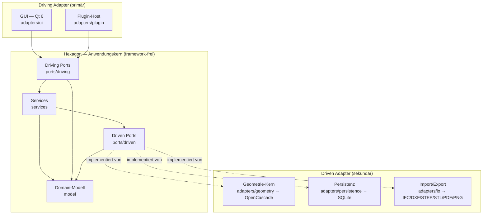
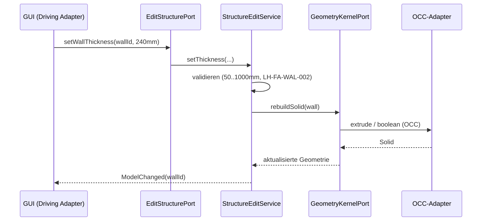
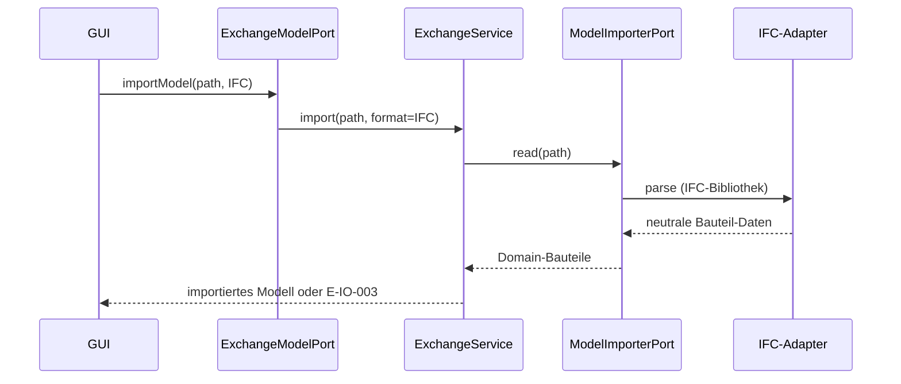

# Architektur — b-cad

**Status:** Outline (Phase 2). **Letzte Änderung:** 2026-06-08.

**Hard Rule:** Diese Datei ist **meilensteinfrei** — sie enthält *keine*
Wellen, Slices, Commit-Hashes oder Closure-Daten (die zeitliche Schicht
lebt in
[`../docs/plan/planning/in-progress/roadmap.md`](../docs/plan/planning/in-progress/roadmap.md)).
Sie zeigt die hexagonale Zerlegung samt Verzeichnis- und
Build-Target-Struktur (die Target-Trennung *ist* die Fitness Function der
Architektur). **Detaillierte API-/Build-Syntax** (OCC-Aufrufe,
CMake-Optionen, Schema) lebt in [`spezifikation.md`](spezifikation.md)
und den ADRs.

**Architektur-Stil.** b-cad folgt einer **hexagonalen Architektur
(Ports & Adapters)**.
Gewählt, weil:

- der **Geometrie-Kern austauschbar** bleiben muss (OpenCascade hinter
  einem Port; ein Wechsel darf den Anwendungskern nicht berühren),
- **mehrere Austauschformate** (IFC/DXF/STEP/STL/PDF/PNG) denselben
  Kern bedienen,
- **2D- und 3D-Sicht aus einem Datenmodell** abgeleitet werden ([OBJ-003](lastenheft.md#3-projektziele))
  — das Modell gehört in den framework-freien Kern,
- **Testbarkeit ohne GUI/OCC/SQLite** über Test-Doubles der Ports
  möglich wird,
- **Plugins** ([OBJ-004](lastenheft.md#3-projektziele)) als weiterer Driving Adapter andocken, ohne den
  Kern zu ändern.

---

## 1. Komponenten-Übersicht



Der **Kern** enthält das parametrische Gebäudemodell und die gesamte
Anwendungslogik. Er kennt weder Qt noch OpenCascade noch SQLite — jede
Kommunikation nach außen läuft über Ports. Ein einziger
**Composition Root** (`main`) verdrahtet konkrete Adapter mit dem Kern;
nur dort werden Adapter-Instanzen injiziert.

### 1.1 Driving Ports (primär — die Außenwelt steuert den Kern)

| Port | Verantwortung | Bezug |
|---|---|---|
| `ManageProjectPort` | Projekt anlegen, speichern, laden, versionieren | [LH-FA-BLD-001](lastenheft.md#lh-fa-bld-001--projekt-anlegen)..004, [ACC-005](lastenheft.md#7-abnahmekriterien) |
| `EditStructurePort` | Bauteile bearbeiten: Geschosse, Wände, Türen, Fenster, Treppen, Dach, Decken, Fundament (parametrisch); **projekt-eigene Materialien verwalten/zuweisen** (Material = Bauteil-Eigenschaft) | LH-FA-FLR/WAL/DOR/WIN/STR/ROF/SLB/FND-*, [LH-FA-MAT-001](lastenheft.md#lh-fa-mat-001--materialien-verwalten)/003, [OBJ-002](lastenheft.md#3-projektziele) |
| `DetectRoomsPort` | Raum-Autoerkennung (geschlossene Wandzüge → Raumpolygone, Netto-Fläche je Raum als Auswertungs-Quelle) | [LH-FA-ROM-001](lastenheft.md#lh-fa-rom-001--raum-automatisch-erkennen)..003 |
| `EvaluatePort` | Auswertungen **read-only** aus dem committeten Modell ableiten (pull, kein Geometrie-Erzeugen): Flächen (Shoelace-Raum-Netto), Volumen (analytisch im Kern), Wohnfläche, Material-/Tür-/Fensterlisten; **Material-Auflösung/-Liste** (Override-Auflösung je Bauteil als Quelle der Material-/Kostenlisten) | [LH-FA-EVL-001](lastenheft.md#lh-fa-evl-001--flächenberechnung)..006, [LH-FA-MAT-002](lastenheft.md#lh-fa-mat-002--materialbibliothek)/003 |
| `ViewModelPort` | 3D-Extrusion und Ansichten (Perspektive, ortho, Schnitt, Explosion) aus dem Modell ableiten; liefert der Darstellung **framework-freie Dreiecksnetze** je `element_id` (Tessellation) | [LH-FA-D3-001](lastenheft.md#modul-3d-modellierung-d3)..006, [ACC-002](lastenheft.md#7-abnahmekriterien) |
| `ExchangeModelPort` | Import/Export anstoßen (Format-neutral) | [LH-FA-IO-001](lastenheft.md#lh-fa-io-001--ifc-import)..008, [ACC-003](lastenheft.md#7-abnahmekriterien), [ACC-004](lastenheft.md#7-abnahmekriterien) |

### 1.2 Driven Ports (sekundär — der Kern steuert die Außenwelt)

| Port | Verantwortung | Bezug |
|---|---|---|
| `GeometryKernelPort` | Solids, boolesche Operationen; extrudiert/tesselliert **Footprint-Polygone** (Footprint-Hoheit inkl. Eckenschluss im Kern, [LH-FA-WAL-006](lastenheft.md#lh-fa-wal-006--wand-verbinden).a/slice-012) und **subtrahiert vom Kern gelieferte Schnitt-Prismen** (Wandöffnungen für Türen/Fenster, [LH-FA-DOR-004](lastenheft.md#lh-fa-dor-004--wandöffnung-automatisch-erzeugen)/WIN-005 — Öffnungs-Semantik bleibt im Kern, der Adapter rechnet nur Geometrie); Tessellation | LH-FA-WAL-*, [LH-FA-D3-001](lastenheft.md#modul-3d-modellierung-d3), [LH-FA-DOR-004](lastenheft.md#lh-fa-dor-004--wandöffnung-automatisch-erzeugen), [LH-FA-WIN-005](lastenheft.md#lh-fa-win-005--wandöffnung-automatisch-erzeugen) |
| `ProjectRepositoryPort` | Projekt **atomar** persistieren und laden; Versionshistorie | [LH-FA-BLD-002](lastenheft.md#lh-fa-bld-002--projekt-speichern)..004, [LH-QA-005](lastenheft.md#lh-qa-005--crash-recovery) |
| `ModelImporterPort` | externes Modell (IFC/DXF) in Domain-Bauteile lesen | [LH-FA-IO-001](lastenheft.md#lh-fa-io-001--ifc-import), [LH-FA-IO-003](lastenheft.md#lh-fa-io-003) |
| `ModelExporterPort` | Domain-Modell in Zielformat schreiben (IFC/DXF/STEP/STL/PDF/PNG) | [LH-FA-IO-002](lastenheft.md#lh-fa-io-002),004,005,006,007,008 |
| `MaterialLibraryPort` | **externer** Material-Katalog/-Import (welle-3 zurückgestellt; die projekt-eigene Material-Verwaltung/-Zuweisung läuft über `EditStructurePort`/`EvaluatePort`, da `materials` projekt-eigen sind) | [LH-FA-MAT-002](lastenheft.md#lh-fa-mat-002--materialbibliothek) |
| `TracingPort` | OTel-Spans emittieren (optional abschaltbar) | (ADR-Folge) |
| `ModelChangedPort` | Beobachter-Schnittstelle: committete Modell-Mutationen melden (Push-Notify `element_id`/`op`, Pull-State über Abfrage-Ports); implementiert von Darstellungs-Adaptern | [LH-FA-D3-002](lastenheft.md#lh-fa-d3-002--echtzeitaktualisierung), [OBJ-003](lastenheft.md#3-projektziele) |

## 2. Schichten und Constraints

| Schicht | Pfad | Verantwortlichkeit | Darf importieren | Darf NICHT importieren |
|---|---|---|---|---|
| Domain-Modell | `src/hexagon/model/` | parametrische Bauteil-Typen, pure Werte, keine I/O, keine Framework-Typen | — (nur Standardbibliothek) | alles andere |
| Driven Ports | `src/hexagon/ports/driven/` | abstrakte Infrastruktur-Schnittstellen | model | services, adapters, Qt/OCC/SQLite |
| Driving Ports | `src/hexagon/ports/driving/` | abstrakte Use-Case-Schnittstellen | model | services, adapters |
| Services | `src/hexagon/services/` | Anwendungslogik; implementiert Driving Ports, nutzt Driven Ports | model, ports | adapters, Qt/OCC/SQLite |
| Geometrie-Adapter | `src/adapters/geometry/` | erfüllt `GeometryKernelPort` via OpenCascade | model, ports/driven | andere Adapter, GUI |
| Persistenz-Adapter | `src/adapters/persistence/` | erfüllt `ProjectRepositoryPort` via SQLite | model, ports/driven | andere Adapter, GUI |
| IO-Adapter | `src/adapters/io/` | erfüllt Importer/Exporter-Ports | model, ports/driven | andere Adapter, GUI |
| GUI-Adapter | `src/adapters/ui/` | Qt; ruft Driving Ports auf | model, ports/driving, ports/driven (*nur* zur Implementierung von Beobachter-Schnittstellen, z. B. `ModelChangedPort`) | Driven Adapter direkt, OCC, SQLite |
| Plugin-Host | `src/adapters/plugin/` | lädt Plugins, vermittelt Driving Ports (Sandbox) | model, ports/driving | Driven Adapter direkt |
| Composition Root | `src/main.cpp` | verdrahtet Adapter mit Kern | alles | — |

**Konsequenz:** Die GUI darf weder OpenCascade noch SQLite direkt
aufrufen — jeder Zugriff geht über einen Driving-Port in den Kern und
von dort über einen Driven-Port in den jeweiligen Adapter. Kein Adapter
kennt einen anderen Adapter. Der Kern kennt nur Port-Schnittstellen,
keine konkrete Implementierung.

### 2.1 Verzeichnis- und Build-Struktur

Die hexagonale Zerlegung wird **im Dateisystem** abgebildet; Kern
(`hexagon/`) und Adapter (`adapters/`) sind auf oberster Ebene getrennt.
Header und Implementierung liegen im selben Verzeichnis, Dateinamen in
`snake_case`, jeder Port ist ein einzelner Header mit einer abstrakten
Klasse (Konvention nach Vorbild `cmake-xray`).

```
b-cad/
├── CMakeLists.txt
├── src/
│   ├── main.cpp                     # Composition Root: Ports ↔ Adapter
│   ├── hexagon/                     # Anwendungskern (framework-frei)
│   │   ├── model/                   # Building, Storey, Wall, Room, Door,
│   │   │                            #   Window, Stair, Roof, Slab, Foundation, Material
│   │   ├── ports/
│   │   │   ├── driving/             # ManageProjectPort, EditStructurePort,
│   │   │   │                        #   DetectRoomsPort, ViewModelPort, ExchangeModelPort
│   │   │   └── driven/              # GeometryKernelPort, ProjectRepositoryPort,
│   │   │                            #   ModelImporterPort, ModelExporterPort, MaterialLibraryPort, TracingPort
│   │   └── services/                # ProjectService, StructureEditService,
│   │                                #   RoomDetectionService, ViewService, ExchangeService
│   └── adapters/
│       ├── ui/                      # Qt 6 (Driving Adapter)
│       ├── plugin/                  # Plugin-Host (Driving Adapter)
│       ├── geometry/                # OpenCascade  (Driven Adapter)
│       ├── persistence/             # SQLite       (Driven Adapter)
│       └── io/                      # IFC/DXF/STEP/STL/PDF/PNG (Driven Adapter)
├── plugins/                         # extern ladbare Plugins (LH-FA-PLG-*)
└── tests/
    ├── hexagon/                     # Kern-Unit-/Integrationstests (Port-Doubles)
    ├── adapters/                    # Adapter-Tests
    └── e2e/                         # End-to-End über die GUI/Headless-Treiber
```

### 2.2 CMake-Targets (Fitness Function)

Die Abhängigkeitsrichtung wird **im Build** erzwungen, nicht nur per
Konvention. Kern und Adapter sind getrennte Bibliotheks-Targets; das
Kern-Target hat **keine** Abhängigkeit auf ein Adapter-Target. Ein
Import aus `adapters/` in `hexagon/` ist damit ein **Link-Fehler**, kein
Review-Befund.

| CMake-Target | Verzeichnis | Abhängigkeiten |
|---|---|---|
| `bcad_hexagon` (library) | `src/hexagon/` | **keine externen** (nur Standardbibliothek) |
| `bcad_adapters` (library) | `src/adapters/` | `bcad_hexagon`, Qt 6, OpenCascade, SQLite, Format-Bibliotheken |
| `b-cad` (executable) | `src/main.cpp` | `bcad_hexagon`, `bcad_adapters` |
| `bcad_tests` (executable) | `tests/` | `bcad_hexagon`, `bcad_adapters`, GoogleTest |

Externe Bibliotheken (Qt, OCC, SQLite) werden **ausschließlich** über
`bcad_adapters` eingebunden — `bcad_hexagon` bleibt frei davon. Der
Architekturtest (`make arch-check`, geplant) prüft diese Trennung
zusätzlich statisch.

## 3. Externe Abhängigkeiten

| System | Rolle | Substituierbarkeit |
|---|---|---|
| OpenCascade (OCC) | Geometrie-Kern: Solids, boolesche Operationen, Extrusion | hinter `GeometryKernelPort` — Wechsel berührt nur `adapters/geometry/` |
| Qt 6 | GUI-Framework (Driving Adapter) | Kern bleibt Qt-frei; GUI ist Adapter |
| SQLite | Projekt-Persistenz (atomar) | hinter `ProjectRepositoryPort` |
| IFC/DXF/STEP/STL-Bibliotheken | Austauschformate | je Format ein Adapter hinter Importer/Exporter-Port |
| OpenTelemetry | Tracing/Observability | hinter `TracingPort`, optional abschaltbar |

Externe Abhängigkeiten dürfen nur in Adaptern auftreten, nie im Kern.

## 4. Sequenz-Diagramme

### Use-Case: LH-FA-WAL-002 — Wandstärke ändern (parametrische Echtzeit, LH-FA-D3-002)



### Use-Case: LH-FA-IO-001 — IFC-Import



## 5. Fehlermodelle und Resilienz

| Fehlerquelle | Behandlung-Schicht | Logging |
|---|---|---|
| Ungültiger Parameter (z. B. Wandstärke) | Service → Klemmung/Ablehnung [`E-VAL-001`](spezifikation.md#4-fehler-codes-und-logging-felder) | `event=validation_rejected` |
| Geometrie-Operation schlägt fehl | Geometrie-Adapter → Service [`E-GEO-002`](spezifikation.md#4-fehler-codes-und-logging-felder) | `event=geometry_error` |
| Schreibfehler / Medium voll | Persistenz-Adapter → [`E-IO-002`](spezifikation.md#4-fehler-codes-und-logging-felder), vorheriger Stand intakt | `event=persist_error` |
| Format nicht erkannt (Import) | IO-Adapter → [`E-IO-003`](spezifikation.md#4-fehler-codes-und-logging-felder), kein Teil-Import | `event=import_rejected` |
| Zielpfad nicht beschreibbar (Export) | IO-Adapter → [`E-IO-001`](spezifikation.md#4-fehler-codes-und-logging-felder), atomar, kein Teil-Export | `event=io_no_permission` |
| Plugin-Fehlverhalten | Plugin-Host isoliert; Modell unverändert (Sandbox) | `event=plugin_error` |

**Atomarität ([LH-QA-005](lastenheft.md#lh-qa-005--crash-recovery), [LH-FA-BLD-002](lastenheft.md#lh-fa-bld-002--projekt-speichern) Boundary).** Die Persistenz
schreibt in eine Temp-Datei und ersetzt den bestehenden Stand erst nach
erfolgreichem Schreiben (Rename). Damit bleibt der letzte konsistente
Projektstand bei jedem Fehler intakt; kein halb geschriebenes Projekt
ist beobachtbar. Operationalisiert durch einen künftigen ADR
(Write-Strategie, analog zur Index-Write-Strategie des Kurs-Beispiels).

## Geschichte

Provenance-Rand (Regelwerk Regel 5): welche ADRs diese — derivative —
Architektur-Sicht prägen. Die normative Begründung lebt in den ADRs
selbst (Aufwärts-Verweis ADR → Spec); der Vollindex steht in
[`../docs/plan/adr/README.md`](../docs/plan/adr/README.md). Diese
Tabelle trägt keine eigene Anforderung und keine zeitliche Schicht
(meilensteinfrei).

| Architektur-Aspekt | Prägende ADR |
|---|---|
| Hexagonale Zerlegung (Ports & Adapters), CMake-Target-Trennung | [ADR-0001](../docs/plan/adr/0001-hexagonale-architektur.md) |
| Geometrie-Kern OpenCascade hinter `GeometryKernelPort` | [ADR-0002](../docs/plan/adr/0002-geometrie-kern-opencascade.md) |
| Projekt-Persistenz SQLite (atomar) | [ADR-0003](../docs/plan/adr/0003-persistenz-sqlite.md) |
| Änderungs-Benachrichtigung über `ModelChangedPort` | [ADR-0008](../docs/plan/adr/0008-aenderungs-benachrichtigung.md) |
| Framework-freie Tessellation über `ViewModelPort` | [ADR-0009](../docs/plan/adr/0009-gui-framework-qt6.md) |
| Bauteil-Erweiterungs-Muster (Wandöffnungen, Dach, Decken, Fundament, Treppen) | [ADR-0011](../docs/plan/adr/0011-bauteil-hosting-wandoeffnung.md) |
| Auswertungs-Architektur `EvaluatePort` (read-only/pull) | [ADR-0012](../docs/plan/adr/0012-evaluations-architektur.md) |
| Material als Bauteil-Eigenschaft (Verwaltung/Zuweisung driving, read-only-Auflösung) | [ADR-0006](../docs/plan/adr/0006-relationales-schema-design.md) + [ADR-0012](../docs/plan/adr/0012-evaluations-architektur.md) |
| Austauschformate: IFC Import+Export über `ExchangeModelPort`/`ModelImporterPort`/`ModelExporterPort` (SPF-Subset-Codec im IO-Adapter) | [ADR-0013](../docs/plan/adr/0013-ifc-bibliothek.md) |
