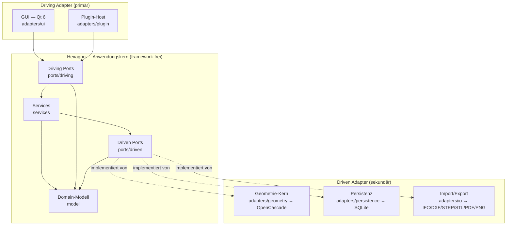
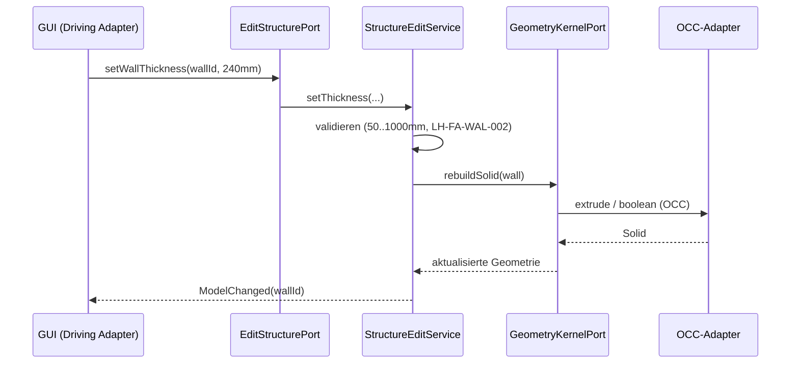
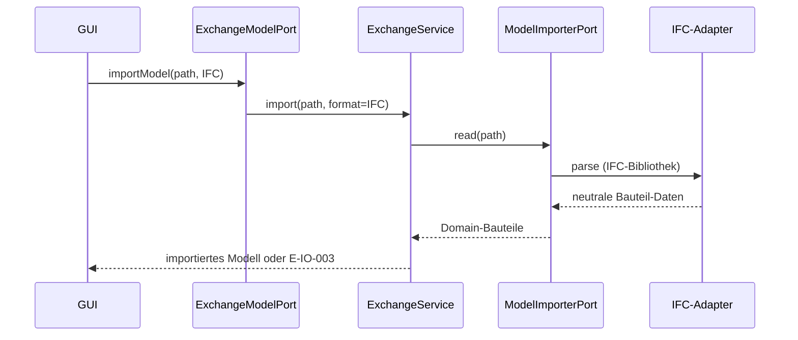

# Architektur — b-cad

**Status:** Outline (Phase 2). **Letzte Änderung:** 2026-06-08.

**Hard Rule:** Diese Datei ist **meilensteinfrei** — sie enthält *keine*
Wellen, Slices, Commit-Hashes oder Closure-Daten (die zeitliche Schicht
lebt in
[`../docs/plan/planning/in-progress/roadmap.md`](../docs/plan/planning/in-progress/roadmap.md)).
Sie zeigt die hexagonale Zerlegung samt Verzeichnis- und
Build-Target-Struktur (die Target-Trennung *ist* die Fitness Function der
Architektur). **Detaillierte API-/Build-Syntax** (OCC-Aufrufe,
CMake-Optionen, Schema) lebt in [`spezifikation.md`](spezifikation.md)
und den ADRs.

**Architektur-Stil.** b-cad folgt einer **hexagonalen Architektur
(Ports & Adapters)** ([ADR-0001](../docs/plan/adr/0001-hexagonale-architektur.md)).
Gewählt, weil:

- der **Geometrie-Kern austauschbar** bleiben muss (OpenCascade hinter
  einem Port; ein Wechsel darf den Anwendungskern nicht berühren),
- **mehrere Austauschformate** (IFC/DXF/STEP/STL/PDF/PNG) denselben
  Kern bedienen,
- **2D- und 3D-Sicht aus einem Datenmodell** abgeleitet werden (OBJ-003)
  — das Modell gehört in den framework-freien Kern,
- **Testbarkeit ohne GUI/OCC/SQLite** über Test-Doubles der Ports
  möglich wird,
- **Plugins** (OBJ-004) als weiterer Driving Adapter andocken, ohne den
  Kern zu ändern.

---

## 1. Komponenten-Übersicht



Der **Kern** enthält das parametrische Gebäudemodell und die gesamte
Anwendungslogik. Er kennt weder Qt noch OpenCascade noch SQLite — jede
Kommunikation nach außen läuft über Ports. Ein einziger
**Composition Root** (`main`) verdrahtet konkrete Adapter mit dem Kern;
nur dort werden Adapter-Instanzen injiziert.

### 1.1 Driving Ports (primär — die Außenwelt steuert den Kern)

| Port | Verantwortung | Bezug |
|---|---|---|
| `ManageProjectPort` | Projekt anlegen, speichern, laden, versionieren | LH-FA-BLD-001..004, ACC-005 |
| `EditStructurePort` | Bauteile bearbeiten: Geschosse, Wände, Türen, Fenster, Treppen, Dach, Decken, Fundament (parametrisch) | LH-FA-FLR/WAL/DOR/WIN/STR/ROF/SLB/FND-*, OBJ-002 |
| `DetectRoomsPort` | Raum-Autoerkennung, Flächen-/Volumenberechnung | LH-FA-ROM-001..003, LH-FA-EVL-001..003 |
| `ViewModelPort` | 3D-Extrusion und Ansichten (Perspektive, ortho, Schnitt, Explosion) aus dem Modell ableiten | LH-FA-D3-001..006, ACC-002 |
| `ExchangeModelPort` | Import/Export anstoßen (Format-neutral) | LH-FA-IO-001..008, ACC-003, ACC-004 |

### 1.2 Driven Ports (sekundär — der Kern steuert die Außenwelt)

| Port | Verantwortung | Bezug |
|---|---|---|
| `GeometryKernelPort` | Solids, boolesche Operationen, Extrusion, Verschneidung (Wandöffnungen) | LH-FA-WAL-*, LH-FA-D3-001, LH-FA-DOR-004, LH-FA-WIN-005 |
| `ProjectRepositoryPort` | Projekt **atomar** persistieren und laden; Versionshistorie | LH-FA-BLD-002..004, LH-QA-005 |
| `ModelImporterPort` | externes Modell (IFC/DXF) in Domain-Bauteile lesen | LH-FA-IO-001, LH-FA-IO-003 |
| `ModelExporterPort` | Domain-Modell in Zielformat schreiben (IFC/DXF/STEP/STL/PDF/PNG) | LH-FA-IO-002,004,005,006,007,008 |
| `MaterialLibraryPort` | Materialien/Texturen/Kennwerte verwalten | LH-FA-MAT-001..006 |
| `TracingPort` | OTel-Spans emittieren (optional abschaltbar) | (ADR-Folge) |

## 2. Schichten und Constraints

| Schicht | Pfad | Verantwortlichkeit | Darf importieren | Darf NICHT importieren | ADR |
|---|---|---|---|---|---|
| Domain-Modell | `src/hexagon/model/` | parametrische Bauteil-Typen, pure Werte, keine I/O, keine Framework-Typen | — (nur Standardbibliothek) | alles andere | ADR-0001 |
| Driven Ports | `src/hexagon/ports/driven/` | abstrakte Infrastruktur-Schnittstellen | model | services, adapters, Qt/OCC/SQLite | ADR-0001 |
| Driving Ports | `src/hexagon/ports/driving/` | abstrakte Use-Case-Schnittstellen | model | services, adapters | ADR-0001 |
| Services | `src/hexagon/services/` | Anwendungslogik; implementiert Driving Ports, nutzt Driven Ports | model, ports | adapters, Qt/OCC/SQLite | ADR-0001 |
| Geometrie-Adapter | `src/adapters/geometry/` | erfüllt `GeometryKernelPort` via OpenCascade | model, ports/driven | andere Adapter, GUI | ADR-0001, ADR-0002 |
| Persistenz-Adapter | `src/adapters/persistence/` | erfüllt `ProjectRepositoryPort` via SQLite | model, ports/driven | andere Adapter, GUI | ADR-0001, ADR-0003 |
| IO-Adapter | `src/adapters/io/` | erfüllt Importer/Exporter-Ports | model, ports/driven | andere Adapter, GUI | ADR-0001 |
| GUI-Adapter | `src/adapters/ui/` | Qt; ruft Driving Ports auf | model, ports/driving | Driven Adapter direkt, OCC, SQLite | ADR-0001 |
| Plugin-Host | `src/adapters/plugin/` | lädt Plugins, vermittelt Driving Ports (Sandbox) | model, ports/driving | Driven Adapter direkt | ADR-0001 |
| Composition Root | `src/main.cpp` | verdrahtet Adapter mit Kern | alles | — | ADR-0001 |

**Konsequenz:** Die GUI darf weder OpenCascade noch SQLite direkt
aufrufen — jeder Zugriff geht über einen Driving-Port in den Kern und
von dort über einen Driven-Port in den jeweiligen Adapter. Kein Adapter
kennt einen anderen Adapter. Der Kern kennt nur Port-Schnittstellen,
keine konkrete Implementierung.

### 2.1 Verzeichnis- und Build-Struktur

Die hexagonale Zerlegung wird **im Dateisystem** abgebildet; Kern
(`hexagon/`) und Adapter (`adapters/`) sind auf oberster Ebene getrennt.
Header und Implementierung liegen im selben Verzeichnis, Dateinamen in
`snake_case`, jeder Port ist ein einzelner Header mit einer abstrakten
Klasse (Konvention nach Vorbild `cmake-xray`).

```
b-cad/
├── CMakeLists.txt
├── src/
│   ├── main.cpp                     # Composition Root: Ports ↔ Adapter
│   ├── hexagon/                     # Anwendungskern (framework-frei)
│   │   ├── model/                   # Building, Storey, Wall, Room, Door,
│   │   │                            #   Window, Stair, Roof, Slab, Foundation, Material
│   │   ├── ports/
│   │   │   ├── driving/             # ManageProjectPort, EditStructurePort,
│   │   │   │                        #   DetectRoomsPort, ViewModelPort, ExchangeModelPort
│   │   │   └── driven/              # GeometryKernelPort, ProjectRepositoryPort,
│   │   │                            #   ModelImporterPort, ModelExporterPort, MaterialLibraryPort, TracingPort
│   │   └── services/                # ProjectService, StructureEditService,
│   │                                #   RoomDetectionService, ViewService, ExchangeService
│   └── adapters/
│       ├── ui/                      # Qt 6 (Driving Adapter)
│       ├── plugin/                  # Plugin-Host (Driving Adapter)
│       ├── geometry/                # OpenCascade  (Driven Adapter)
│       ├── persistence/             # SQLite       (Driven Adapter)
│       └── io/                      # IFC/DXF/STEP/STL/PDF/PNG (Driven Adapter)
├── plugins/                         # extern ladbare Plugins (LH-FA-PLG-*)
└── tests/
    ├── hexagon/                     # Kern-Unit-/Integrationstests (Port-Doubles)
    ├── adapters/                    # Adapter-Tests
    └── e2e/                         # End-to-End über die GUI/Headless-Treiber
```

### 2.2 CMake-Targets (Fitness Function)

Die Abhängigkeitsrichtung wird **im Build** erzwungen, nicht nur per
Konvention. Kern und Adapter sind getrennte Bibliotheks-Targets; das
Kern-Target hat **keine** Abhängigkeit auf ein Adapter-Target. Ein
Import aus `adapters/` in `hexagon/` ist damit ein **Link-Fehler**, kein
Review-Befund.

| CMake-Target | Verzeichnis | Abhängigkeiten |
|---|---|---|
| `bcad_hexagon` (library) | `src/hexagon/` | **keine externen** (nur Standardbibliothek) |
| `bcad_adapters` (library) | `src/adapters/` | `bcad_hexagon`, Qt 6, OpenCascade, SQLite, Format-Bibliotheken |
| `b-cad` (executable) | `src/main.cpp` | `bcad_hexagon`, `bcad_adapters` |
| `bcad_tests` (executable) | `tests/` | `bcad_hexagon`, `bcad_adapters`, GoogleTest |

Externe Bibliotheken (Qt, OCC, SQLite) werden **ausschließlich** über
`bcad_adapters` eingebunden — `bcad_hexagon` bleibt frei davon. Der
Architekturtest (`make arch-check`, geplant) prüft diese Trennung
zusätzlich statisch.

## 3. Externe Abhängigkeiten

| System | Rolle | ADR | Substituierbarkeit |
|---|---|---|---|
| OpenCascade (OCC) | Geometrie-Kern: Solids, boolesche Operationen, Extrusion | ADR-0002 | hinter `GeometryKernelPort` — Wechsel berührt nur `adapters/geometry/` |
| Qt 6 | GUI-Framework (Driving Adapter) | ADR-Folge (geplant) | Kern bleibt Qt-frei; GUI ist Adapter |
| SQLite | Projekt-Persistenz (atomar) | ADR-0003 | hinter `ProjectRepositoryPort` |
| IFC/DXF/STEP/STL-Bibliotheken | Austauschformate | ADR-Folge (geplant) | je Format ein Adapter hinter Importer/Exporter-Port |
| OpenTelemetry | Tracing/Observability | ADR-Folge (geplant) | hinter `TracingPort`, optional abschaltbar |

Externe Abhängigkeiten dürfen nur in Adaptern auftreten, nie im Kern.

## 4. Sequenz-Diagramme

### Use-Case: LH-FA-WAL-002 — Wandstärke ändern (parametrische Echtzeit, LH-FA-D3-002)



### Use-Case: LH-FA-IO-001 — IFC-Import



## 5. Fehlermodelle und Resilienz

| Fehlerquelle | Behandlung-Schicht | Logging |
|---|---|---|
| Ungültiger Parameter (z. B. Wandstärke) | Service → Klemmung/Ablehnung `E-VAL-001` | `event=validation_rejected` |
| Geometrie-Operation schlägt fehl | Geometrie-Adapter → Service `E-GEO-002` | `event=geometry_error` |
| Schreibfehler / Medium voll | Persistenz-Adapter → `E-IO-002`, vorheriger Stand intakt | `event=persist_error` |
| Format nicht erkannt (Import) | IO-Adapter → `E-IO-003`, kein Teil-Import | `event=import_rejected` |
| Plugin-Fehlverhalten | Plugin-Host isoliert; Modell unverändert (Sandbox) | `event=plugin_error` |

**Atomarität (LH-QA-005, LH-FA-BLD-002 Boundary).** Die Persistenz
schreibt in eine Temp-Datei und ersetzt den bestehenden Stand erst nach
erfolgreichem Schreiben (Rename). Damit bleibt der letzte konsistente
Projektstand bei jedem Fehler intakt; kein halb geschriebenes Projekt
ist beobachtbar. Operationalisiert durch einen künftigen ADR
(Write-Strategie, analog zur Index-Write-Strategie des Kurs-Beispiels).

## 6. ADR-Index

Vollständige Liste in
[`../docs/plan/adr/README.md`](../docs/plan/adr/README.md).

- [ADR-0001](../docs/plan/adr/0001-hexagonale-architektur.md) — Hexagonale Architektur (Ports & Adapters); Abhängigkeitsrichtung über getrennte CMake-Targets erzwungen. **Accepted.**
- [ADR-0002](../docs/plan/adr/0002-geometrie-kern-opencascade.md) — Geometrie-Kern OpenCascade hinter `GeometryKernelPort` (Backend: Solids/Extrusion/Booleans/Wandöffnungen; STEP-Export ausgegliedert in künftige IO/Export-ADR). **Accepted.**
- [ADR-0003](../docs/plan/adr/0003-persistenz-sqlite.md) — Projekt-Persistenz SQLite, atomar geschrieben. **Proposed.**
